# DealFlow360 — Architecture

> Comprehensive architecture reference for the DealFlow360 Intelligent Sales Operations Platform.
> For a quick summary, see [README.md](./README.md).

---

## Table of Contents

1. [System Purpose & Scope](#1-system-purpose--scope)
2. [High-Level System Context](#2-high-level-system-context)
3. [Bounded Contexts & Service Decomposition](#3-bounded-contexts--service-decomposition)
4. [Deployment Topology](#4-deployment-topology)
5. [API Gateway / BFF](#5-api-gateway--bff)
6. [Auth Service](#6-auth-service)
7. [Catalog Service](#7-catalog-service)
8. [Quotation Service](#8-quotation-service)
9. [Fulfillment Service](#9-fulfillment-service)
10. [Billing Service](#10-billing-service)
11. [Analytics Service](#11-analytics-service)
12. [Frontend Architecture](#12-frontend-architecture)
13. [Event-Driven Communication](#13-event-driven-communication)
14. [Data Architecture](#14-data-architecture)
15. [Authentication & Authorization](#15-authentication--authorization)
16. [Caching Strategy](#16-caching-strategy)
17. [Key Business Flows](#17-key-business-flows)
18. [Resilience & Failure Modes](#18-resilience--failure-modes)
19. [Testing Strategy](#19-testing-strategy)

---

## 1. System Purpose & Scope

DealFlow360 is an **Intelligent, Self-Governing Sales Operations Platform** for B2B sales teams. It covers the complete quotation-to-cash lifecycle:

| Domain | Capabilities |
|--------|-------------|
| **Quoting** | Line-level discount entry, real-time margin computation, blended risk scoring |
| **Approval Governance** | Multi-level approval routing driven by risk score thresholds |
| **Customer Portal** | Magic-link authenticated portal; customers view and negotiate quotations |
| **Fulfillment** | Multi-warehouse stock, smart split algorithm, automatic backorder creation |
| **Billing** | One-time invoices + recurring subscription billing, proration, credit notes |
| **Analytics** | Deal health monitoring, anomaly alerts, PDF/XLS report export |

### Actor Model

| Actor | Type | Authentication |
|-------|------|----------------|
| Sales Rep | Internal | JWT (email + password) |
| Sales Manager | Internal | JWT (email + password) |
| Finance User | Internal | JWT (email + password) |
| Admin | Internal | JWT (email + password) |
| Customer | External | Magic Link OR email + password -> portal session token |

---

## 2. High-Level System Context

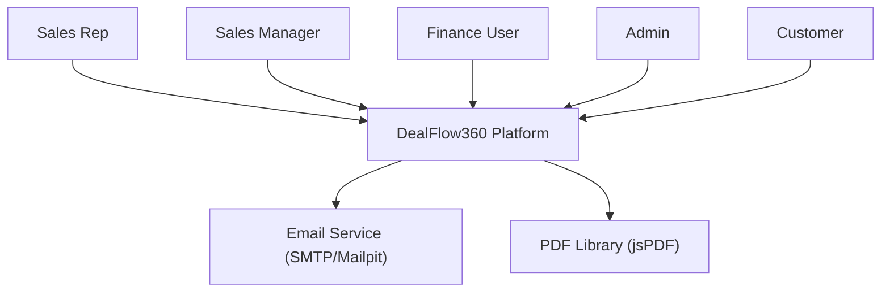

---

## 3. Bounded Contexts & Service Decomposition

The system is decomposed into **6 microservices** based on clear domain boundaries.

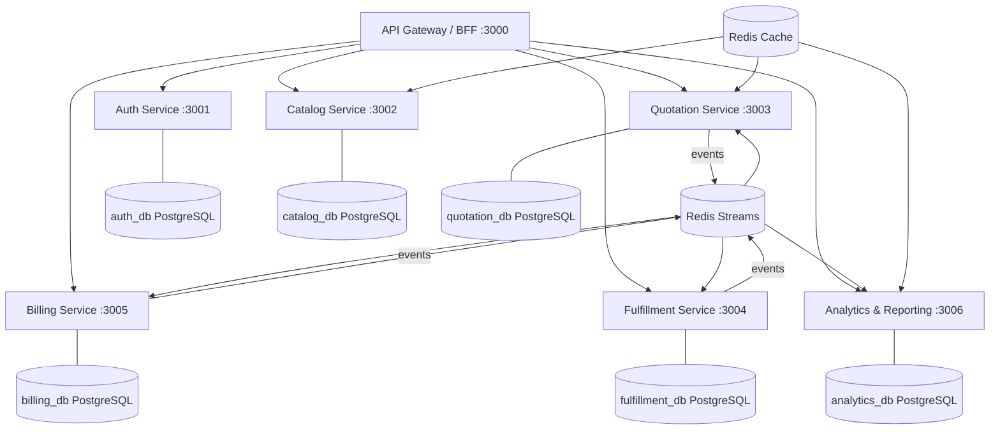

### Why Each Service Exists

| Service | Reason for Existence |
|---------|---------------------|
| **Auth Service** | Security boundary — authentication logic must be isolated and independently deployable. Owns identity data. |
| **Catalog Service** | Independent business responsibility — products, price lists, discount tiers, and upsell rules are admin concerns, not tied to quotation lifecycle. |
| **Quotation Service** | Core domain — the quotation lifecycle (creation, approval routing, blended risk scoring, customer negotiation) is the largest bounded context. Owns the quotation state machine. |
| **Fulfillment Service** | Separate data ownership — warehouse stock, splits, and backorders are physically independent of quoting. Requires independent scaling. |
| **Billing Service** | Separate business responsibility — recurring billing, proration, invoicing, and credit notes are a distinct financial domain with independent compliance requirements. |
| **Analytics Service** | Computational isolation — report aggregation, export generation, and deal health computation are read-heavy queries that must not block transactional services. |

---

## 4. Deployment Topology

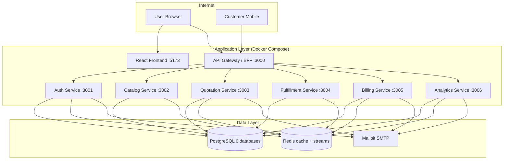

### Container Inventory

| Container | Image | Host Port(s) |
|-----------|-------|-------------|
| `gateway` | Custom Fastify | `3000` |
| `auth-service` | Custom Fastify | `3001` |
| `catalog-service` | Custom Fastify | `3002` |
| `quotation-service` | Custom Fastify | `3003` |
| `fulfillment-service` | Custom Fastify | `3004` |
| `billing-service` | Custom Fastify | `3005` |
| `analytics-service` | Custom Fastify | `3006` |
| `frontend` | Custom Vite dev | `5173` |
| `auth-db` | `postgres:16-alpine` | `5432` |
| `catalog-db` | `postgres:16-alpine` | `5433` |
| `quotation-db` | `postgres:16-alpine` | `5434` |
| `fulfillment-db` | `postgres:16-alpine` | `5435` |
| `billing-db` | `postgres:16-alpine` | `5436` |
| `analytics-db` | `postgres:16-alpine` | `5437` |
| `redis` | `redis:7-alpine` | `6379` |
| `mailpit` | `axllent/mailpit` | `1025` (SMTP), `8025` (Web UI) |

### Network & Trust Boundaries

| Boundary | Description |
|----------|-------------|
| **Internet -> Nginx** | Public internet, TLS enforced |
| **Nginx -> Frontend** | Static file serving |
| **Nginx -> Gateway** | Reverse proxy; only Gateway is externally exposed |
| **Gateway -> Services** | Internal Docker network; not externally accessible |
| **Services -> Databases** | Internal network; credentials via env vars |
| **Services -> Redis** | Internal network |
| **Services -> Email** | Outbound SMTP only |

---

## 5. API Gateway / BFF

**Technology**: Fastify 4 + `@fastify/http-proxy`

The Gateway is the **single entry point** for all client traffic. It is stateless.

### Responsibilities

| Responsibility | Implementation |
|----------------|----------------|
| JWT validation | `jwtAuthMiddleware` — validates HS256 token, injects userId + role into headers |
| Portal session auth | `portalAuthMiddleware` — validates session token from Redis |
| Request ID injection | `requestIdMiddleware` — adds `X-Request-ID` for tracing |
| Rate limiting | 100 req/min global via `@fastify/rate-limit` (Redis-backed) |
| CORS | `@fastify/cors` — `credentials: true`, configurable origins |
| Health check aggregation | `GET /health/:service` — queries upstream services |
| Proxy routing | `@fastify/http-proxy` — prefix rewrite per service |

### Route Table

```
Internal (JWT required):
  /api/v1/auth/*           -> auth-service:3001/auth/*       (no JWT — auth owns login)
  /api/v1/catalog/*        -> catalog-service:3002/catalog/*
  /api/v1/quotations/*     -> quotation-service:3003/quotations/*
  /api/v1/fulfillment/*    -> fulfillment-service:3004/fulfillment/*
  /api/v1/billing/*        -> billing-service:3005/billing/*
  /api/v1/analytics/*      -> analytics-service:3006/analytics/*

Portal (portal session required):
  /portal/v1/auth/*        -> auth-service:3001/portal/auth/*   (no portal auth)
  /portal/v1/quotations/*  -> quotation-service:3003/portal/quotations/*
  /portal/v1/fulfillment/* -> fulfillment-service:3004/portal/fulfillment/*
```

### Error Format (RFC 7807 Problem Details)

```json
{
  "type": "https://dealflow360.com/errors/rate-limit-exceeded",
  "title": "Too Many Requests",
  "status": 429,
  "detail": "Rate limit exceeded. Try again in 45s.",
  "instance": "/api/v1/quotations"
}
```

---

## 6. Auth Service

**Port**: `3001` | **Database**: `auth_db`

### Domain Services

| Service | Responsibility |
|---------|---------------|
| `AuthService` | User signup/login, JWT generation, password hashing, refresh token management |
| `MagicLinkService` | Generate and verify single-use magic link tokens (UUID, 24h TTL, stored in Redis) |
| `PortalSessionService` | Create and validate httpOnly session tokens (7-day TTL in Redis) |

### Routes

| Route Group | Prefix | Endpoints |
|-------------|--------|-----------|
| Internal auth | `/auth` | POST /signup, POST /login, POST /refresh, POST /logout, GET /me |
| Portal auth | `/portal/auth` | POST /magic-link, GET /verify, POST /login, POST /logout |

### Database Schema (auth_db)

| Table | Key Columns |
|-------|------------|
| `User` | `id`, `email`, `password_hash`, `name`, `role`, `is_active` |
| `RefreshToken` | `id`, `user_id`, `token_hash`, `expires_at`, `revoked_at` |
| `CustomerPortalCredential` | `id`, `customer_id`, `email`, `password_hash` (nullable) |

### Redis Keys

| Key Pattern | TTL | Content |
|-------------|-----|---------|
| `magic_link:<uuid>` | 86400s (24h) | `{ customerId, email, used }` |
| `session:<token>` | 604800s (7d) | `{ customerId, email }` |

---

## 7. Catalog Service

**Port**: `3002` | **Database**: `catalog_db`

### Domain Services

| Service | Entities Managed |
|---------|-----------------|
| `ProductService` | Products, variants, categories |
| `PriceListService` | Price lists with tier-based pricing |
| `DiscountTierService` | Per-tier, per-category discount ceiling config |
| `ApprovalChainService` | Approval routing rules (risk threshold to approver roles) |
| `UpsellRuleService` | Upsell/cross-sell trigger conditions and recommendations |

### Database Schema (catalog_db)

| Table | Key Columns |
|-------|------------|
| `Product` | `id`, `sku`, `name`, `base_price`, `category_id`, `is_active` |
| `Category` | `id`, `name`, `parent_id` |
| `PriceList` | `id`, `name`, `currency`, `valid_from`, `valid_to` |
| `PriceListItem` | `id`, `price_list_id`, `product_id`, `unit_price` |
| `DiscountTier` | `id`, `tier_name`, `max_discount_pct`, `category_id` |
| `ApprovalChain` | `id`, `min_risk_score`, `max_risk_score`, `required_roles[]` |
| `SubscriptionPlan` | `id`, `name`, `billing_interval`, `price`, `currency` |
| `UpsellRule` | `id`, `trigger_product_id`, `recommend_product_id`, `condition` |
| `Warehouse` | `id`, `name`, `location`, `is_active` |

### Catalog as Shared Reference Data

Other services read catalog data via:
1. Synchronous HTTP API calls (Quotation Service at quote-build time)
2. Redis cache (discount ceilings 5 min TTL, product list 10 min TTL)

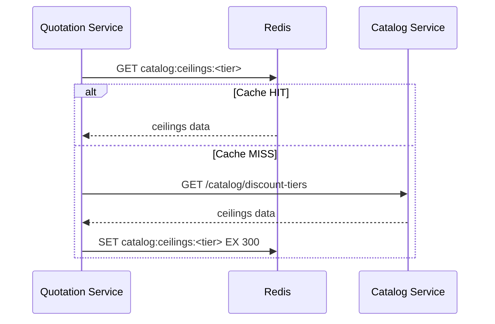

---

## 8. Quotation Service

**Port**: `3003` | **Database**: `quotation_db`

This is the **core domain** of DealFlow360.

### Domain Services

| Service | Responsibility |
|---------|---------------|
| `QuotationService` | Full quotation lifecycle — create, add lines, submit, approve, reject, confirm, negotiate |
| `RiskScoreService` | Compute blended risk score across all quotation lines |

### Quotation State Machine

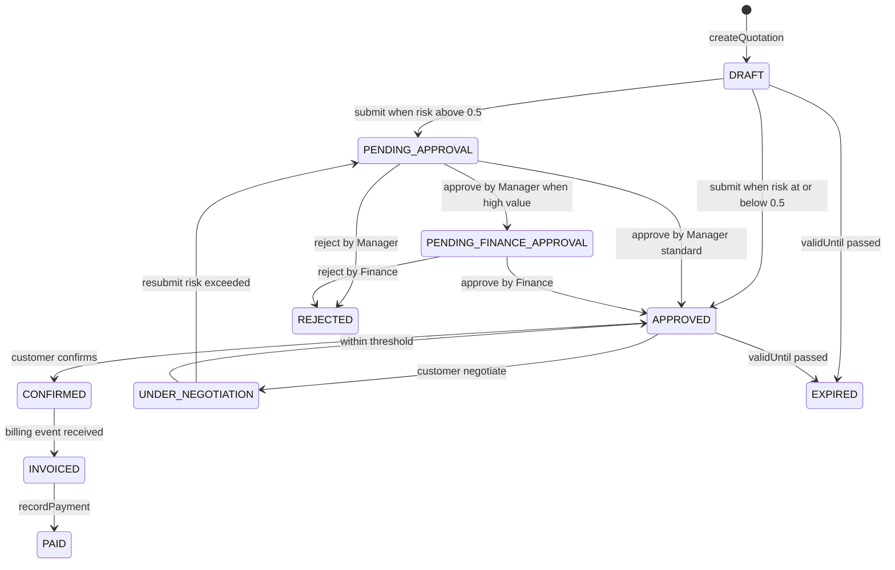

### Blended Risk Score

```
Risk Score = weighted average of (discountPct / discountCeiling) per line
             x category weight x deal-size weight

Range -> Routing:
  < 0.5   = Auto-approved
  0.5-0.8 = Manager approval
  > 0.8   = Manager + Finance dual approval
```

### Database Schema (quotation_db)

| Table | Key Columns |
|-------|------------|
| `Customer` | `id`, `company_id`, `name`, `email`, `tier`, `portal_access` |
| `Quotation` | `id`, `customer_id`, `rep_id`, `status`, `blended_risk_score`, `total_amount`, `valid_until`, `version` |
| `QuotationLine` | `id`, `quotation_id`, `product_id`, `product_name` (snapshot), `qty`, `unit_price`, `discount_pct`, `line_total`, `margin_pct` |
| `ApprovalLog` | `id`, `quotation_id`, `action`, `approver_id`, `approver_name` (snapshot), `reason`, `created_at` |
| `Negotiation` | `id`, `quotation_id`, `customer_id`, `proposed_discount`, `message`, `status` |

### Repositories

| Repository | Key Operations |
|------------|---------------|
| `QuotationRepository` | `create`, `findById`, `list`, `updateStatus`, `addLine`, `updateLine`, `deleteLine` |
| `CustomerRepository` | `create`, `findById`, `findByEmail`, `list`, `update` |
| `ApprovalLogRepository` | `create`, `findByQuotationId` |
| `NegotiationRepository` | `create`, `findByQuotationId` |

### Event Publishing

| Method | Stream | Event Type |
|--------|--------|-----------|
| `publishQuotationApproved` | `dealflow360:quotation` | `quotation.approved` |
| `publishQuotationConfirmed` | `dealflow360:quotation` | `quotation.confirmed` |
| `publishQuotationRejected` | `dealflow360:quotation` | `quotation.rejected` |
| `publishQuotationStatusChanged` | `dealflow360:quotation` | `quotation.status_changed` |
| `publishNegotiationReceived` | `dealflow360:quotation` | `quotation.negotiation_received` |

### Inter-Service HTTP Calls

| Call | Target | Purpose |
|------|--------|---------|
| `GET /catalog/discount-tiers` | Catalog Service | Fetch discount ceilings for risk scoring |
| `GET /catalog/products/:id` | Catalog Service | Validate product + get price |
| `GET /fulfillment/stock` | Fulfillment Service | Check stock availability |

---

## 9. Fulfillment Service

**Port**: `3004` | **Database**: `fulfillment_db`

### Domain Services

| Service | Responsibility |
|---------|---------------|
| `StockService` | Warehouse stock CRUD, stock reservation |
| `FulfillmentOrderService` | Create and manage fulfillment orders, update status |
| `SplitAlgorithmService` | Compute optimal warehouse split for quotation lines |

### Split Algorithm

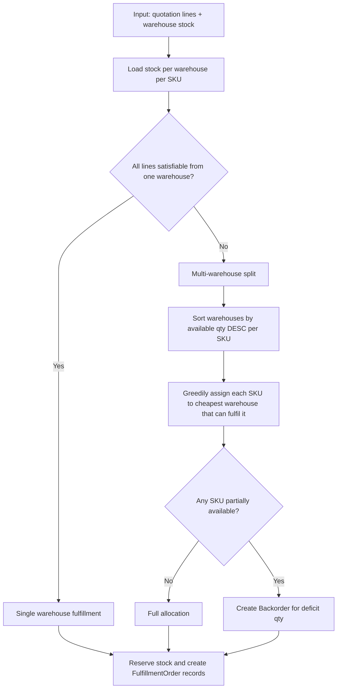

### Database Schema (fulfillment_db)

| Table | Key Columns |
|-------|------------|
| `WarehouseStock` | `id`, `warehouse_id`, `sku`, `qty_available`, `qty_reserved` |
| `FulfillmentOrder` | `id`, `quotation_id`, `warehouse_id`, `status`, `lines[]` |
| `Backorder` | `id`, `fulfillment_order_id`, `sku`, `qty_pending`, `expected_at` |

---

## 10. Billing Service

**Port**: `3005` | **Database**: `billing_db`

### Domain Services

| Service | Responsibility |
|---------|---------------|
| `BillingService` | Create invoices, record payments, issue credit notes, manage subscriptions |
| `ProrationService` | Compute mid-cycle subscription proration amounts |
| `CancellationService` | Handle subscription cancellations with correct billing cutoff |

### Invoice State Machine

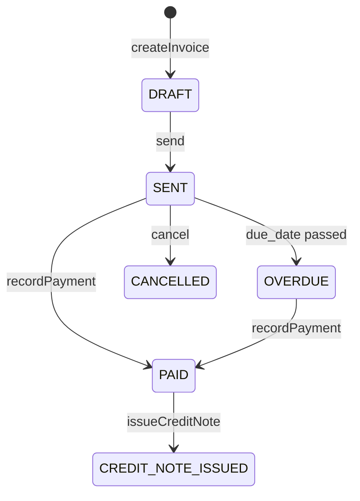

### Database Schema (billing_db)

| Table | Key Columns |
|-------|------------|
| `Invoice` | `id`, `quotation_id`, `customer_id`, `status`, `total_amount`, `currency`, `due_date` |
| `InvoiceLine` | `id`, `invoice_id`, `description`, `qty`, `unit_price`, `line_total` |
| `Subscription` | `id`, `customer_id`, `plan_id`, `status`, `billing_interval`, `next_billing_at` |
| `BillingSchedule` | `id`, `subscription_id`, `scheduled_at`, `status` |
| `CreditNote` | `id`, `invoice_id`, `amount`, `reason`, `issued_at` |
| `PaymentRecord` | `id`, `invoice_id`, `amount`, `method`, `paid_at` |

### Event Consumption

| Event | Action Taken |
|-------|-------------|
| `quotation.confirmed` | Auto-generate invoice with quotation lines |
| `quotation.approved` | Pre-calculate expected billing amounts |

### Background Jobs

A cron job processes `BillingSchedule` records to generate subscription renewal invoices on schedule.

---

## 11. Analytics Service

**Port**: `3006` | **Database**: `analytics_db`

### Domain Services

| Service | Responsibility |
|---------|---------------|
| `AnalyticsService` | Aggregate snapshots; compute pipeline KPIs, win rates, revenue metrics |
| `DealHealthService` | Compute deal health scores; detect anomalies (stale quotes, overdue approvals) |
| `ReportExportService` | Generate PDF and XLS exports of pipeline reports |

### Database Schema (analytics_db)

| Table | Key Columns |
|-------|------------|
| `QuotationSnapshot` | `id`, `quotation_id`, `status`, `total_amount`, `rep_id`, `risk_score`, `captured_at` |
| `DealHealthRecord` | `id`, `quotation_id`, `health_score`, `flags[]`, `computed_at` |
| `Alert` | `id`, `type`, `severity`, `quotation_id`, `message`, `is_resolved`, `created_at` |

### Event Consumption

| Event | Action Taken |
|-------|-------------|
| `quotation.status_changed` | Update `QuotationSnapshot` record |
| `quotation.confirmed` | Mark snapshot confirmed; update MRR projection |
| `quotation.rejected` | Record loss; update win/loss ratio |
| `billing.invoice_created` | Update revenue metrics |
| `billing.subscription_renewed` | Update recurring revenue data |
| `fulfillment.shipment_delayed` | Create delivery slippage alert |

### Background Jobs

| Job | Schedule | Purpose |
|-----|----------|---------|
| `DealHealthCronJob` | Configurable (e.g. every 5 min) | Refresh deal health scores; create alerts |

---

## 12. Frontend Architecture

**Port**: `5173` | **Framework**: React 18 + Vite 5

### Two Distinct Runtime Contexts

| Context | URL Prefix | Audience | Auth Method |
|---------|-----------|----------|-------------|
| **Internal Workspace** | `/app/*` | Sales Rep, Manager, Finance, Admin | JWT cookie/header |
| **Customer Portal** | `/portal/*` | Customer | Session token / magic link |

These contexts have separate routing trees, auth flows, and API clients with no cross-contamination.

### Pages

| Page | Context | Role Access |
|------|---------|------------|
| `UnifiedAuthPage` | Internal | All internal roles |
| `DashboardPage` | Internal | All |
| `QuotationsPage` | Internal | All |
| `QuotationBuilderPage` | Internal | Sales Rep, Manager |
| `QuotationApprovalPage` | Internal | Manager, Finance |
| `CatalogPage` | Internal | Admin |
| `FulfillmentPage` | Internal | Manager, Finance, Admin |
| `BillingPage` | Internal | Finance, Admin |
| `AnalyticsPage` | Internal | All |
| `ReportsPage` | Internal | All |
| `UsersPage` | Internal | Admin |
| Portal pages | Portal | Customer only |

### State Management

| Store | Technology | Purpose |
|-------|-----------|---------|
| `auth.store` | Zustand | JWT token, current user, role |
| `portal-auth.store` | Zustand | Portal session token, customer info |
| `ui.store` | Zustand | Sidebar state, modal state |
| Server queries | TanStack Query | All API data fetching and caching |

---

## 13. Event-Driven Communication

**Technology**: Redis Streams (Redis 7) with `ioredis` 5
**Pattern**: Consumer Groups

### Why Redis Streams

| Feature | Redis Streams | Kafka |
|---------|--------------|-------|
| Persistent messages | Yes | Yes |
| Consumer groups | Yes | Yes |
| Zero extra infrastructure | Yes (reuses existing Redis) | No |
| Sufficient throughput for scale | Yes | Yes |
| Operational complexity | Low | High |

### Stream Architecture

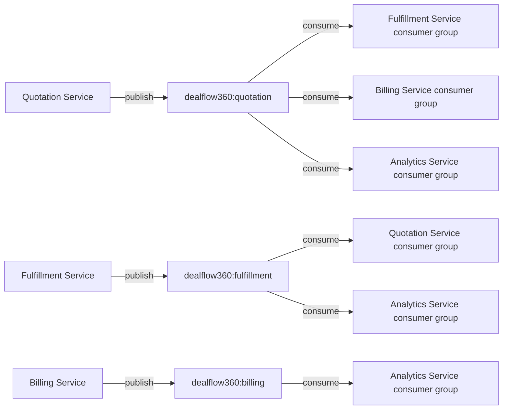

### Complete Event Catalog

| Event | Producer | Consumers | Payload Key Fields |
|-------|----------|-----------|-------------------|
| `quotation.approved` | Quotation | Fulfillment, Billing | quotationId, lines[], totalAmount, currency |
| `quotation.confirmed` | Quotation | Billing, Analytics | quotationId, customerId, lines[], confirmedAt |
| `quotation.rejected` | Quotation | Analytics | quotationId, customerId, reason |
| `quotation.status_changed` | Quotation | Analytics | quotationId, previousStatus, newStatus, blendedRiskScore |
| `quotation.negotiation_received` | Quotation | Analytics | quotationId, proposedDiscount, message |
| `fulfillment.stock_arrived` | Fulfillment | Quotation | sku, warehouseId, quantity |
| `fulfillment.shipment_delayed` | Fulfillment | Analytics | fulfillmentOrderId, expectedAt, delayedUntil |
| `billing.invoice_created` | Billing | Analytics | invoiceId, quotationId, totalAmount, currency |
| `billing.subscription_renewed` | Billing | Analytics | subscriptionId, customerId, mrr, currency |

### Event Envelope Schema

```typescript
interface DomainEvent<T = unknown> {
  eventId:   string;     // UUID v4 — idempotency key
  eventType: string;     // e.g. "quotation.confirmed"
  version:   "1.0";      // schema version
  companyId: string;     // multi-company isolation key
  timestamp: string;     // ISO 8601 UTC
  payload:   T;
}
```

---

## 14. Data Architecture

### One Database Per Service — No Cross-DB Reads

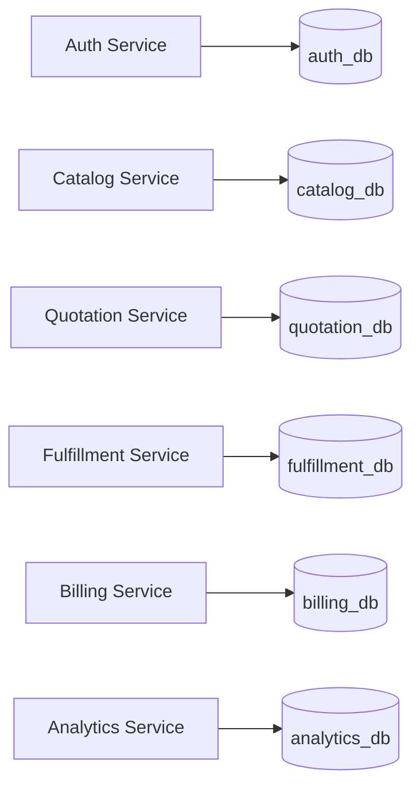

### Data Classification

| Classification | Description | Examples |
|---------------|-------------|---------|
| **Authoritative** | Source of truth; only the owning service writes | Quotation status, Invoice amount, Stock level |
| **Derived** | Computed from authoritative data | Blended risk score, Line total, Proration amount |
| **Snapshot** | Authoritative data captured at point in time | productName in QuotationLine, approverName in ApprovalLog |
| **Cached** | Temporary copy for performance | Discount ceilings in Redis, Product list |
| **Projection** | Eventual-consistency replica | QuotationSnapshot in analytics_db |
| **Temporary** | Short-lived, purged after use | Magic link tokens (Redis, 24h TTL) |

### Cross-Service Data Strategy

| Need | Mechanism |
|------|-----------|
| Real-time lookup | Synchronous HTTP API calls with Redis cache fallback |
| Eventual consistency | Redis Streams events consumed by downstream service |
| Snapshot at time-of-action | Denormalized fields stored at write time |
| Frequently-read config | Redis cache (discount ceilings 5 min, catalog 10 min) |

---

## 15. Authentication & Authorization

### Internal User Authentication Flow

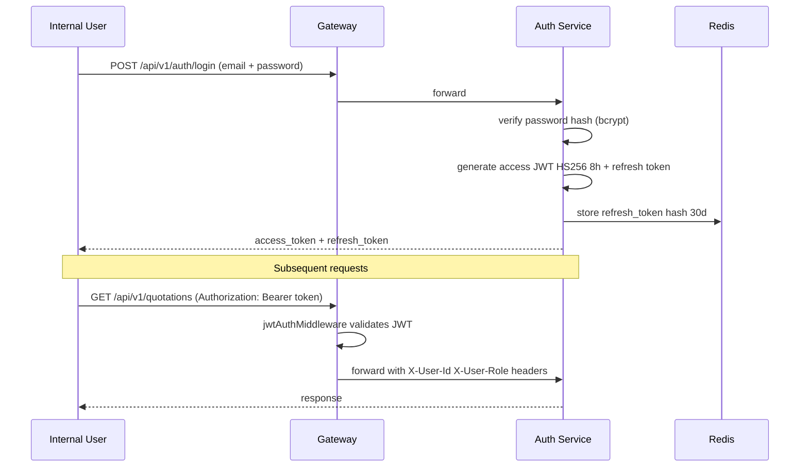

### Customer Portal Authentication Flow

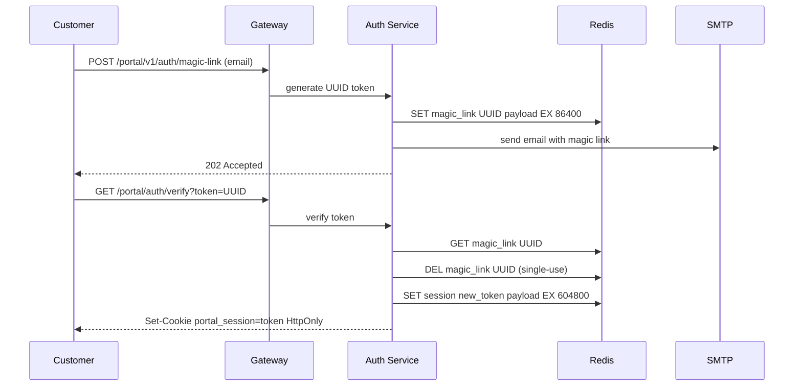

### RBAC Matrix

| Role | Quotations | Approvals | Catalog Config | Fulfillment | Billing | Reports |
|------|-----------|-----------|----------------|-------------|---------|---------|
| **Admin** | All companies | All | Full CRUD | View all | View all | Full |
| **Sales Manager** | Own team | Approve/Reject | View | View all | View | Team reports |
| **Finance** | All | 2nd-level Approve/Reject | View | Full | Full | Full |
| **Sales Rep** | Own (rep_id=userId) | Submit only | View | View | View | Own only |
| **Customer (Portal)** | Own (customerId) | None | None | None | None | None |

### Auth Mechanisms

| Mechanism | Used By | Details |
|-----------|---------|---------|
| **JWT Bearer HS256** | Internal users | 8-hour access token, 30-day refresh |
| **Portal Session Token** | Customer portal | Opaque UUID, httpOnly cookie, 7-day TTL |
| **Magic Link** | Customer portal | Single-use UUID, 24-hour TTL in Redis |
| **Service Token** | Service-to-service | X-Service-Token header, shared secret |

---

## 16. Caching Strategy

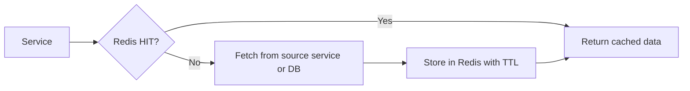

| Cache | Key Pattern | TTL | Invalidation |
|-------|------------|-----|-------------|
| Discount ceilings | `catalog:ceilings:<tier>:<category>` | 5 min | Admin updates discount tier |
| Product catalog | `catalog:products:list` | 10 min | Admin updates product |
| Upsell rules | `catalog:upsell:rules` | 15 min | Admin updates rules |
| Portal sessions | `session:<token>` | 7 days | Logout or TTL expiry |
| Magic link tokens | `magic_link:<uuid>` | 24 h | Used (deleted on verify) or TTL |
| Analytics snapshots | `analytics:dashboard:<companyId>` | 1 min | New quotation event received |

---

## 17. Key Business Flows

### 17.1 Quotation Creation & Risk Scoring

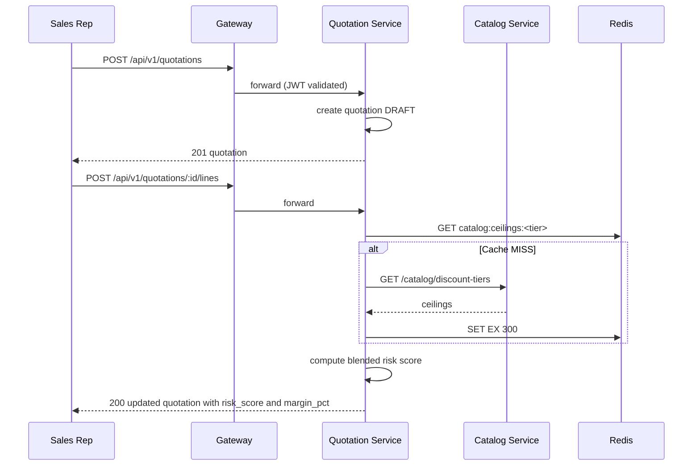

### 17.2 Approval Routing

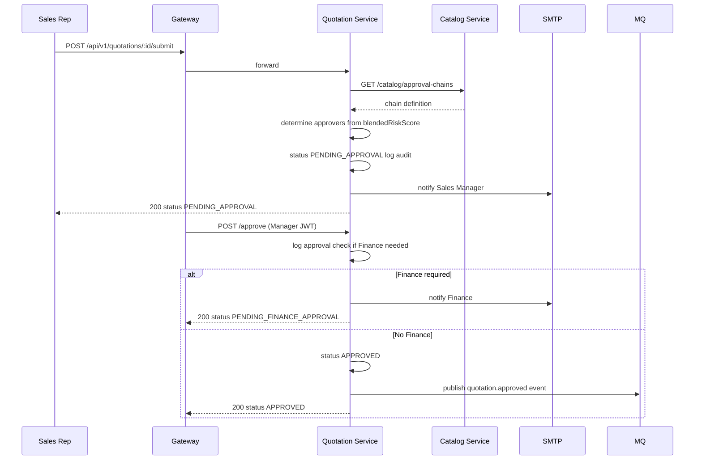

### 17.3 Customer Portal Negotiation

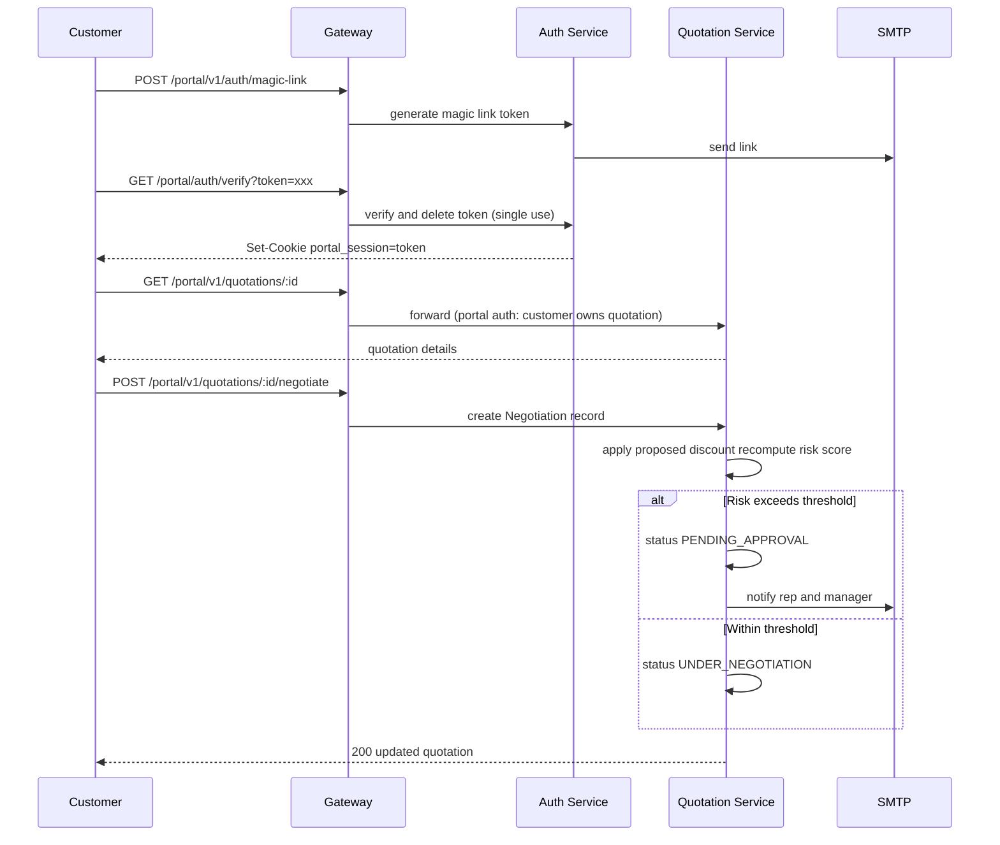

### 17.4 Quotation-to-Cash End-to-End

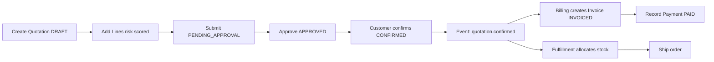

---

## 18. Resilience & Failure Modes

| Failure | Other Services Affected | Degradation | Mitigation |
|---------|------------------------|------------|-----------|
| Auth Service down | All (login blocked) | High — new logins fail; existing JWTs still work | Independent restart; stateless JWT |
| Catalog Service down | Quotation creation degraded | Medium | Redis-cached discount ceilings (5 min TTL) |
| Fulfillment Service down | Quotation split deferred | Low | Quotation approves; split deferred with user message |
| Billing Service down | None (async via events) | Low | Event queued in Redis Streams; auto-processed on recovery |
| Analytics Service down | None | Low (dashboard stale) | Shows last-updated timestamp |
| Redis down | All services (perf) | Medium | Fall back to direct DB reads; events pause until recovery |
| Message lost in stream | Downstream consumers | Low | Consumer groups + XACK; dead-letter stream for failures |

### Health Check Matrix

| Service | Endpoint | Dependencies Checked |
|---------|---------|---------------------|
| Gateway | `GET /health` | None (stateless) |
| Auth | `GET /health` | PostgreSQL, Redis |
| Catalog | `GET /health` | PostgreSQL, Redis |
| Quotation | `GET /health` | PostgreSQL, Redis |
| Fulfillment | `GET /health` | PostgreSQL |
| Billing | `GET /health` | PostgreSQL |
| Analytics | `GET /health` | PostgreSQL |

---

## 19. Testing Strategy

| Layer | Tool | Coverage Target |
|-------|------|----------------|
| Unit — domain services | Vitest | Risk score algorithm, split algorithm, proration logic |
| Unit — repositories | Vitest + mock Prisma | Query construction, error handling |
| Integration — service layer | Vitest + real PostgreSQL | Full request/response through Fastify app |
| E2E — cross-service | Playwright / custom runner | Full quotation-to-cash flows |
| API — gateway routing | Custom `.mjs` scripts | Proxy rewrite, auth enforcement |

### Key Test Scenarios

| Scenario | Type | Services |
|----------|------|---------|
| Blended risk score computation | Unit | Quotation |
| Approval routing by risk threshold | Integration | Quotation, Auth |
| Portal customer cannot access internal routes | Integration | Gateway, Auth |
| Split algorithm — multi-warehouse + backorder | Unit | Fulfillment |
| Proration calculation | Unit | Billing |
| Quotation confirmed triggers invoice + fulfillment | E2E | Quotation, Billing, Fulfillment |
| Magic link is single-use | Integration | Auth |
| JWT refresh token rotation | Integration | Auth |

---

*DealFlow360 — Odoo Hackathon Final Round 2026*
