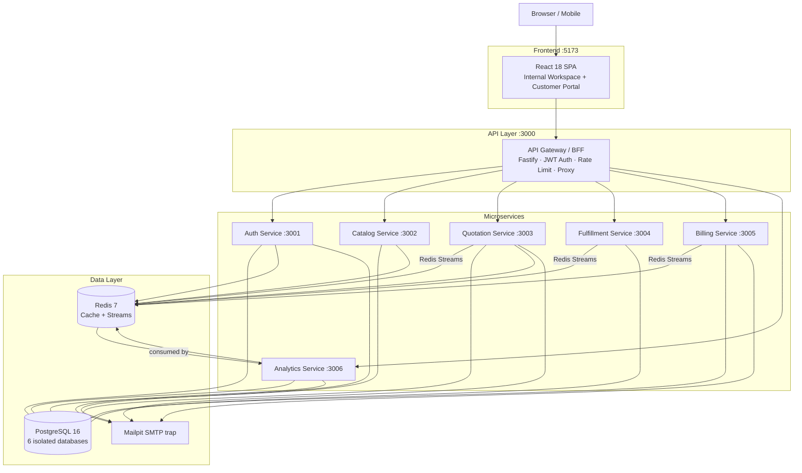
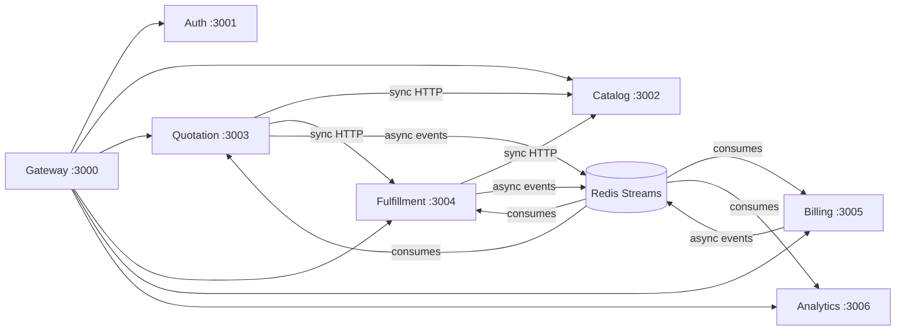
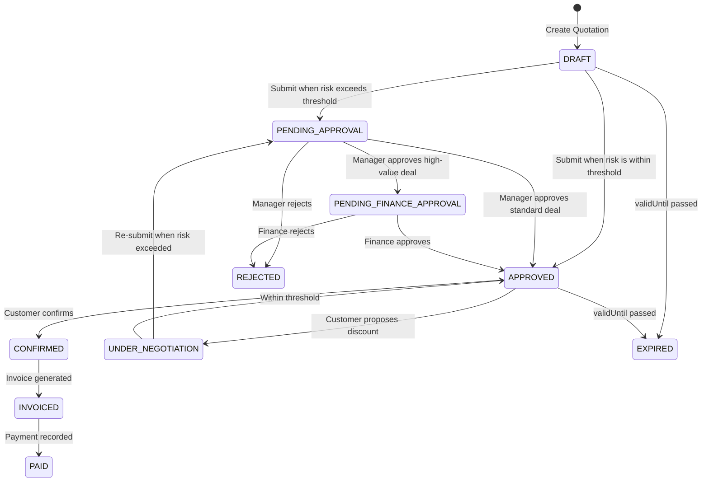
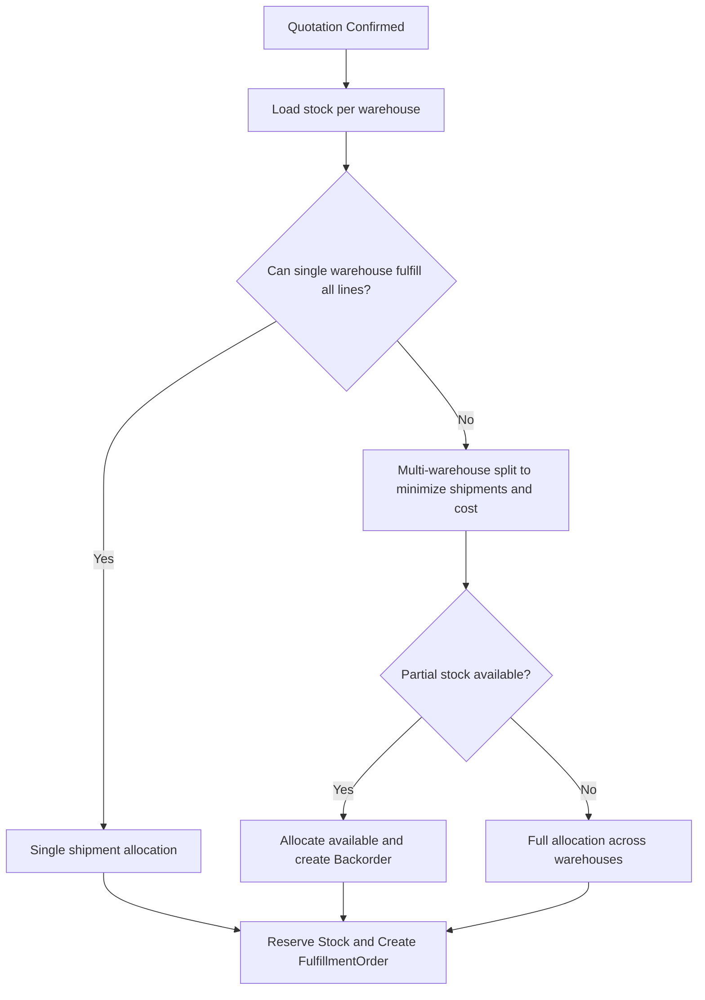
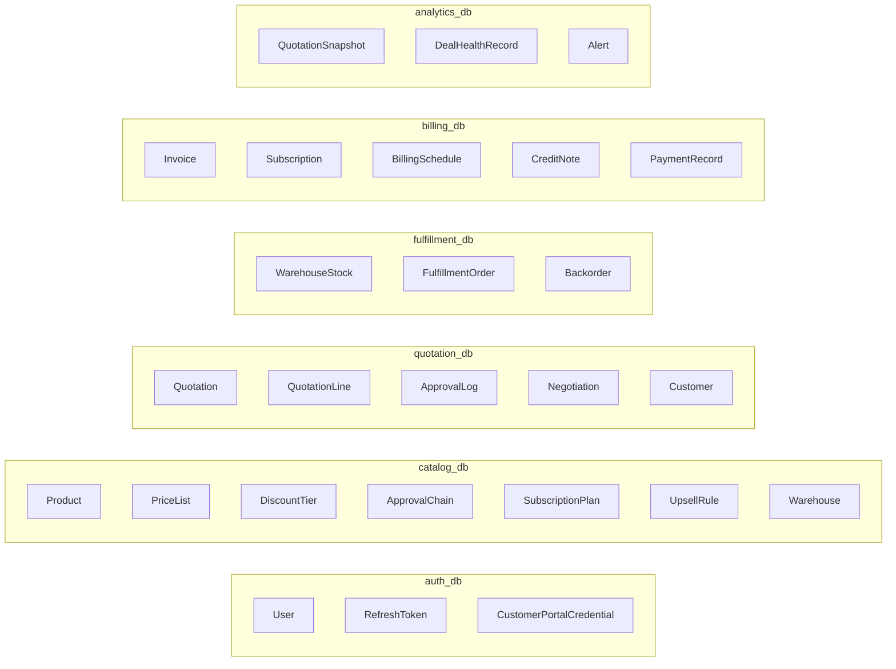

<div align="center">
  

# DealFlow360

**Intelligent, Self-Governing Sales Operations Platform**

*Odoo Hackathon — Final Round 2026*

[](https://nodejs.org/)
[](https://www.typescriptlang.org/)
[](https://www.fastify.io/)
[](https://react.dev/)
[](https://www.postgresql.org/)
[](https://redis.io/)
[](https://docs.docker.com/compose/)

</div>

---

## Table of Contents

- [Overview](#overview)
- [Architecture at a Glance](#architecture-at-a-glance)
- [Services](#services)
- [Tech Stack](#tech-stack)
- [Quick Start](#quick-start)
- [Demo Credentials](#demo-credentials)
- [Key Features](#key-features)
- [Event-Driven Communication](#event-driven-communication)
- [API Surface](#api-surface)
- [Data Model](#data-model)
- [Authentication & Authorization](#authentication--authorization)
- [Caching Strategy](#caching-strategy)
- [Resilience & Failure Modes](#resilience--failure-modes)
- [Development Guide](#development-guide)
- [Testing](#testing)
- [Project Structure](#project-structure)

---

## Overview

DealFlow360 is a **full-stack, microservices-based B2B sales operations platform** that handles the complete **quotation-to-cash lifecycle**. Built for sales teams that need automated discount governance, real-time risk scoring, multi-warehouse fulfillment splitting, and hybrid billing.

### What It Does

| Capability | Description |
|------------|-------------|
| **Quotation Builder** | Line-level discount entry with real-time margin & blended risk score computation |
| **Approval Routing** | Rule-based multi-level approval chains (Manager to Finance) driven by risk score |
| **Customer Portal** | Magic-link authenticated portal for customers to view & negotiate live quotations |
| **Warehouse Splitting** | Smart split algorithm across multi-warehouse inventory; automatic backorder creation |
| **Hybrid Billing** | One-time invoices mixed with recurring subscription lines, proration & credit notes |
| **Deal Health** | Automated anomaly detection, delivery slippage alerts, win/loss analytics |
| **Reports & Export** | PDF/XLS export of pipeline reports, revenue summaries, deal health snapshots |

---

## Architecture at a Glance

> Full deep-dive: [ARCHITECTURE.md](./ARCHITECTURE.md)

### System Topology



### Service Dependency Map



---

## Services

| Service | Port | Responsibility | Database | Key Entities |
|---------|------|----------------|----------|--------------|
| **Gateway (BFF)** | `3000` | JWT validation, HTTP proxy, CORS, rate-limiting | — | Routing, auth middleware |
| **Auth Service** | `3001` | User identity, JWT tokens, magic links, portal sessions | `auth_db` | User, RefreshToken, CustomerPortalCredential |
| **Catalog Service** | `3002` | Products, price lists, discount tiers, approval chains, upsell rules | `catalog_db` | Product, PriceList, DiscountTier, ApprovalChain |
| **Quotation Service** | `3003` | Quote lifecycle, risk scoring, approval routing, customer negotiation | `quotation_db` | Quotation, QuotationLine, ApprovalLog, Negotiation |
| **Fulfillment Service** | `3004` | Warehouse stock, split algorithm, backorders | `fulfillment_db` | WarehouseStock, FulfillmentOrder, Backorder |
| **Billing Service** | `3005` | Invoices, subscriptions, proration, credit notes | `billing_db` | Invoice, Subscription, BillingSchedule, CreditNote |
| **Analytics Service** | `3006` | Deal health, dashboards, PDF/XLS reports | `analytics_db` | QuotationSnapshot, DealHealthRecord, Alert |
| **Frontend** | `5173` | React SPA — internal workspace + customer portal | — | All pages |

### Gateway Routing Table

| Gateway Prefix | Proxied To | Auth |
|----------------|-----------|------|
| `/api/v1/auth/*` | Auth `/auth/*` | None (auth owns login) |
| `/api/v1/catalog/*` | Catalog `/catalog/*` | JWT |
| `/api/v1/quotations/*` | Quotation `/quotations/*` | JWT |
| `/api/v1/fulfillment/*` | Fulfillment `/fulfillment/*` | JWT |
| `/api/v1/billing/*` | Billing `/billing/*` | JWT |
| `/api/v1/analytics/*` | Analytics `/analytics/*` | JWT |
| `/portal/v1/auth/*` | Auth `/portal/auth/*` | None |
| `/portal/v1/quotations/*` | Quotation `/portal/quotations/*` | Portal session |
| `/portal/v1/fulfillment/*` | Fulfillment `/portal/fulfillment/*` | Portal session |

---

## Tech Stack

### Backend

| Layer | Technology | Version |
|-------|-----------|---------|
| Runtime | Node.js | 20 LTS |
| Language | TypeScript | 5.x |
| Framework | Fastify | 4.x |
| ORM | Prisma | 5.x |
| Database | PostgreSQL | 16 |
| Cache / Events | Redis (ioredis) | 7 / 5.x |
| Validation | Zod | 3.x |
| Email | Nodemailer + Mailpit | — |
| Auth | JWT HS256 + bcrypt | — |

### Frontend

| Layer | Technology | Version |
|-------|-----------|---------|
| Framework | React | 18.x |
| Build Tool | Vite | 5.x |
| Routing | React Router DOM | 6.x |
| Server State | TanStack Query | 5.x |
| Client State | Zustand | 4.x |
| Forms | React Hook Form + Zod | 7.x / 3.x |
| Charts | Recharts | 2.x |
| PDF export | jsPDF | 4.x |
| HTTP Client | Axios | 1.x |
| Styling | Tailwind CSS | 3.x |
| Icons | Lucide React | 0.468 |
| Toasts | Sonner | 1.x |

### Infrastructure

| Component | Technology |
|-----------|-----------|
| Containerization | Docker Compose |
| SMTP trap (dev) | Mailpit |
| Testing | Vitest + Playwright |

---

## Quick Start

**Prerequisites:** [Docker Desktop](https://www.docker.com/products/docker-desktop/) (Compose v2)

```bash
# 1. Clone & configure
cp .env.example .env

# 2. Start everything (13 containers total)
docker compose up -d

# 3. Watch health checks (~60s first run)
docker compose ps

# 4. Open the app
# http://localhost:5173  — Internal workspace
# http://localhost:8025  — Mailpit (catches all emails)
```

### Available URLs

| URL | Description |
|-----|-------------|
| `http://localhost:5173` | Frontend — internal workspace |
| `http://localhost:8025` | Mailpit — email catcher (magic links) |
| `http://localhost:3000/health` | Gateway health check |
| `http://localhost:3001/docs` | Auth Service Swagger |
| `http://localhost:3002/docs` | Catalog Service Swagger |
| `http://localhost:3003/docs` | Quotation Service Swagger |
| `http://localhost:3004/docs` | Fulfillment Service Swagger |
| `http://localhost:3005/docs` | Billing Service Swagger |
| `http://localhost:3006/docs` | Analytics Service Swagger |

---

## Demo Credentials

### Internal Workspace

| Role | Email | Password |
|------|-------|----------|
| **Admin** | `admin@dealflow360.com` | `AdminP@ss123` |
| **Sales Manager** | `manager@dealflow360.com` | `ManagerP@ss123` |
| **Finance** | `finance@dealflow360.com` | `FinanceP@ss123` |
| **Sales Rep** | `rep1@dealflow360.com` | `RepP@ss123` |

### Customer Portal

Portal uses **magic links**. Request a link at `/portal/auth`, check [Mailpit](http://localhost:8025) for the email, click the link to establish a session.

---

## Key Features

### Quotation State Machine



### Blended Risk Score

The Quotation Service computes a blended risk score across all lines:

```
Risk Score = weighted avg of (discountPct / discountCeiling) per line
             x category weight x deal-size weight
```

| Score Range | Routing Result |
|-------------|----------------|
| `< 0.5` | Auto-approved, no routing needed |
| `0.5 to 0.8` | Sales Manager approval required |
| `> 0.8` | Manager + Finance dual approval required |

### Warehouse Split Algorithm



---

## Event-Driven Communication

Services communicate asynchronously via **Redis Streams** (consumer groups).

### Streams

| Stream Key | Producer | Consumers |
|------------|----------|-----------|
| `dealflow360:quotation` | Quotation Service | Fulfillment, Billing, Analytics |
| `dealflow360:fulfillment` | Fulfillment Service | Quotation, Analytics |
| `dealflow360:billing` | Billing Service | Analytics |

### Event Catalog

| Event Type | Producer | Consumers | Purpose |
|-----------|----------|-----------|---------|
| `quotation.approved` | Quotation | Fulfillment, Billing | Trigger stock split + invoice gen |
| `quotation.confirmed` | Quotation | Billing, Analytics | Final invoice + analytics update |
| `quotation.rejected` | Quotation | Analytics | Win/loss tracking |
| `quotation.status_changed` | Quotation | Analytics | Dashboard refresh |
| `quotation.negotiation_received` | Quotation | Analytics | Track negotiation |
| `fulfillment.stock_arrived` | Fulfillment | Quotation | Prompt backorder consolidation |
| `fulfillment.shipment_delayed` | Fulfillment | Analytics | Delivery slippage alert |
| `billing.invoice_created` | Billing | Analytics | MRR tracking |
| `billing.subscription_renewed` | Billing | Analytics | Recurring revenue data |

### Event Envelope

```typescript
interface DomainEvent<T = unknown> {
  eventId:   string;   // UUID v4 — unique per event
  eventType: string;   // e.g. "quotation.confirmed"
  version:   "1.0";
  companyId: string;   // for multi-company routing
  timestamp: string;   // ISO 8601 UTC
  payload:   T;
}
```

---

## API Surface

### Auth Service (`:3001`)

| Method | Path | Description |
|--------|------|-------------|
| `POST` | `/auth/signup` | Register internal user |
| `POST` | `/auth/login` | Email + password to JWT |
| `POST` | `/auth/refresh` | Refresh access token |
| `POST` | `/auth/logout` | Revoke refresh token |
| `GET` | `/auth/me` | Current user info |
| `POST` | `/portal/auth/magic-link` | Request portal magic link |
| `GET` | `/portal/auth/verify` | Verify magic link to session |
| `POST` | `/portal/auth/login` | Portal email + password login |
| `POST` | `/portal/auth/logout` | Invalidate portal session |

### Catalog Service (`:3002`)

| Method | Path | Description |
|--------|------|-------------|
| `GET/POST` | `/catalog/products` | List / create products |
| `GET/PATCH/DELETE` | `/catalog/products/:id` | Product CRUD |
| `GET/POST` | `/catalog/price-lists` | Price list management |
| `GET/POST` | `/catalog/discount-tiers` | Discount tier config |
| `GET/POST` | `/catalog/approval-chains` | Approval chain config |
| `GET/POST` | `/catalog/upsell-rules` | Upsell/cross-sell rules |
| `GET/POST` | `/catalog/subscription-plans` | Subscription plan definitions |
| `GET/POST` | `/catalog/warehouses` | Warehouse config |
| `GET/POST` | `/catalog/categories` | Product categories |

### Quotation Service (`:3003`)

| Method | Path | Description |
|--------|------|-------------|
| `POST` | `/quotations` | Create quotation |
| `GET` | `/quotations` | List quotations (filtered) |
| `GET` | `/quotations/:id` | Get quotation + lines |
| `PATCH` | `/quotations/:id` | Update metadata |
| `POST` | `/quotations/:id/lines` | Add line item |
| `PATCH` | `/quotations/:id/lines/:lineId` | Update line discount |
| `DELETE` | `/quotations/:id/lines/:lineId` | Remove line |
| `POST` | `/quotations/:id/submit` | Submit for approval |
| `POST` | `/quotations/:id/approve` | Approve (Manager/Finance) |
| `POST` | `/quotations/:id/reject` | Reject quotation |
| `POST` | `/quotations/:id/confirm` | Customer confirms |
| `GET` | `/quotations/customers` | List customers |
| `POST` | `/portal/quotations/:id/negotiate` | Customer proposes discount |

### Fulfillment Service (`:3004`)

| Method | Path | Description |
|--------|------|-------------|
| `GET` | `/fulfillment/stock` | Query warehouse stock |
| `PATCH` | `/fulfillment/stock/:id` | Adjust stock level |
| `GET` | `/fulfillment/orders` | List fulfillment orders |
| `POST` | `/fulfillment/orders` | Create fulfillment order |
| `PATCH` | `/fulfillment/orders/:id/status` | Update order status |
| `GET` | `/fulfillment/orders/:id/split` | Get split recommendation |

### Billing Service (`:3005`)

| Method | Path | Description |
|--------|------|-------------|
| `GET/POST` | `/billing/invoices` | List / create invoices |
| `GET/PATCH` | `/billing/invoices/:id` | Invoice detail / update |
| `POST` | `/billing/invoices/:id/payment` | Record payment |
| `POST` | `/billing/invoices/:id/credit-note` | Issue credit note |
| `GET/POST` | `/billing/subscriptions` | Subscription management |
| `PATCH` | `/billing/subscriptions/:id` | Update subscription |
| `POST` | `/billing/subscriptions/:id/cancel` | Cancel subscription |

### Analytics Service (`:3006`)

| Method | Path | Description |
|--------|------|-------------|
| `GET` | `/analytics/dashboard` | Dashboard KPIs |
| `GET` | `/analytics/deal-health` | Deal health scores |
| `GET` | `/analytics/reports` | Pipeline / revenue reports |
| `GET` | `/analytics/reports/export` | PDF / XLS export |
| `GET` | `/analytics/alerts` | Active anomaly alerts |

---

## Data Model

### Database Ownership



### Cross-Service Data Strategy — No Shared Databases

| Need | Mechanism |
|------|-----------|
| Real-time lookup | Synchronous HTTP API calls (with Redis cache fallback) |
| Eventual consistency | Redis Streams events consumed by downstream service |
| Snapshot at time-of-action | Denormalized fields stored at write time (e.g. `productName` in `QuotationLine`) |
| Frequently-read config | Redis cache (discount ceilings 5 min TTL, catalog 10 min TTL) |

---

## Authentication & Authorization

### Auth Mechanisms

| Mechanism | Used By | Details |
|-----------|---------|---------|
| **JWT Bearer** (HS256) | Internal users | 8-hour access token, 30-day refresh token |
| **Portal Session Token** | Customer portal | Opaque UUID, httpOnly cookie, 7-day TTL in Redis |
| **Magic Link** | Customer portal | Single-use UUID, 24-hour TTL in Redis |
| **Service Token** | Service-to-service | `X-Service-Token` header, shared secret |

### RBAC Matrix

| Role | Quotations | Approvals | Catalog Config | Fulfillment | Billing | Reports |
|------|-----------|-----------|----------------|-------------|---------|---------|
| **Admin** | All | All | Full | View | View | Full |
| **Sales Manager** | Team's | Approve/Reject | View | View | View | Team |
| **Finance** | All | 2nd-level Approve/Reject | View | All | Full | Full |
| **Sales Rep** | Own | Submit only | View | View | View | Own |
| **Customer (Portal)** | Own only | None | None | None | None | None |

---

## Caching Strategy

| Cache Key Pattern | Store | TTL | Data |
|-------------------|-------|-----|------|
| `catalog:ceilings:*` | Redis | 5 min | Discount ceilings per tier/category |
| `catalog:products:*` | Redis | 10 min | Product list + prices |
| `catalog:upsell:*` | Redis | 15 min | Upsell rules |
| `session:<token>` | Redis | 7 days | Customer portal session |
| `magic_link:<uuid>` | Redis | 24 h | One-time portal access token |
| `analytics:snapshot:*` | Redis | 1 min | Dashboard KPI data |

---

## Resilience & Failure Modes

| Failure | Impact | Mitigation |
|---------|--------|-----------|
| Auth Service down | Login blocked; existing JWTs still work | Gateway 503; other services unaffected |
| Catalog Service down | Quotation creation degraded | Quotation uses Redis-cached ceilings (5 min TTL) |
| Fulfillment down | Split calc deferred | Quotation approves; user sees degraded message |
| Billing down | Invoice delayed | Event queued in Redis Streams; auto-retry on recovery |
| Analytics down | Dashboard stale | Shows last-updated timestamp |
| Redis down | Cache miss; events pause | Services fall back to direct DB reads |
| Message lost | Potential data gap | Consumer groups + XACK + dead-letter stream |

---

## Development Guide

```bash
# View logs for a specific service
docker compose logs -f quotation-service

# Open a shell in a running container
docker compose exec quotation-service sh

# Run Prisma migrations
docker compose exec auth-service sh -c "npx prisma migrate dev --name <name>"

# Reseed a service database
docker compose exec quotation-service sh -c "npx ts-node src/db/seed.ts"

# Reset all data (drop volumes)
docker compose down -v && docker compose up -d
```

### Port Reference

| Service | Host Port |
|---------|-----------|
| Frontend | `5173` |
| Gateway | `3000` |
| Auth Service | `3001` |
| Catalog Service | `3002` |
| Quotation Service | `3003` |
| Fulfillment Service | `3004` |
| Billing Service | `3005` |
| Analytics Service | `3006` |
| PostgreSQL (auth) | `5432` |
| PostgreSQL (catalog) | `5433` |
| PostgreSQL (quotation) | `5434` |
| PostgreSQL (fulfillment) | `5435` |
| PostgreSQL (billing) | `5436` |
| PostgreSQL (analytics) | `5437` |
| Redis | `6379` |
| Mailpit SMTP | `1025` |
| Mailpit Web UI | `8025` |

---

## Testing

```bash
# Run tests for a specific service
docker compose exec auth-service npm test

# Unit tests only
docker compose exec quotation-service npm run test:unit

# Integration tests (requires live DBs)
docker compose exec quotation-service npm run test:integration

# Gateway E2E test suite
docker compose exec gateway node e2e-suite-test.mjs
```

| Layer | Tool | Scope |
|-------|------|-------|
| Unit tests | Vitest | Domain services, risk score, split algorithm |
| Integration tests | Vitest + real DB | Repository layer, full service flows |
| E2E tests | Playwright / custom runner | Cross-service flows |
| API tests | Custom `.mjs` scripts | Gateway proxy routing |

---

## Project Structure

```
Odoo-Hackathon-Final-Round-2026/
├── docker-compose.yml            # Full stack orchestration
├── .env.example                  # Root environment template
├── ARCHITECTURE.md               # Deep-dive architecture document
│
├── frontend/                     # React 18 + Vite SPA
│   ├── src/
│   │   ├── app/pages/            # Route-level page components
│   │   ├── components/domain/    # Feature-specific components
│   │   ├── components/ui/        # Shared UI primitives
│   │   ├── stores/               # Zustand stores
│   │   ├── api/                  # Axios API clients
│   │   └── portal/               # Customer portal context
│   └── public/                   # Static assets + logo
│
├── services/
│   ├── gateway/                  # API Gateway / BFF (Fastify)
│   ├── auth-service/             # Identity & sessions
│   ├── catalog-service/          # Products & configuration
│   ├── quotation-service/        # Core quotation domain
│   ├── fulfillment-service/      # Warehouse & logistics
│   ├── billing-service/          # Invoicing & subscriptions
│   └── analytics-service/        # Reporting & deal health
│
├── packages/shared/              # Shared TypeScript types & event schemas
│
└── docs/                         # 18-document architecture specification
    ├── 00-requirements.md
    ├── 01-overall-architecture.md
    └── ... (through 17-requirement-traceability.md)
```

Each service shares this internal structure:

```
<service>/src/
├── api/
│   ├── middleware/               # Auth, validation hooks
│   └── routes/                   # Route handlers
├── domain/services/              # Business logic (pure, testable)
├── db/
│   ├── prisma/                   # Schema + migrations
│   └── repositories/             # Data access layer
├── events/                       # Redis Streams publisher + consumer
├── integrations/                 # HTTP clients to other services
├── jobs/                         # Background cron jobs
├── config/env.ts                 # Zod-validated env vars
├── app.ts                        # Fastify app factory
└── server.ts                     # Entry point
```

---

## Related Documents

| Document | Description |
|----------|-------------|
| [ARCHITECTURE.md](./ARCHITECTURE.md) | Full architecture — all diagrams, data models, flows |
| [docs/01-overall-architecture.md](./docs/01-overall-architecture.md) | System context & bounded contexts |
| [docs/05-quotation-service.md](./docs/05-quotation-service.md) | Quotation domain deep-dive |
| [docs/14-event-driven-communication.md](./docs/14-event-driven-communication.md) | Full event catalog |
| [docs/15-testing-strategy.md](./docs/15-testing-strategy.md) | Testing approach |
| [docs/16-deployment-and-devops.md](./docs/16-deployment-and-devops.md) | Deployment & DevOps |

---

<div align="center">

Built with love for the **Odoo Hackathon Final Round 2026**

</div>
