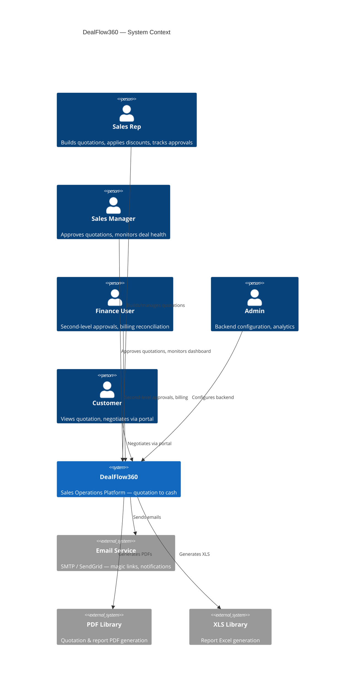
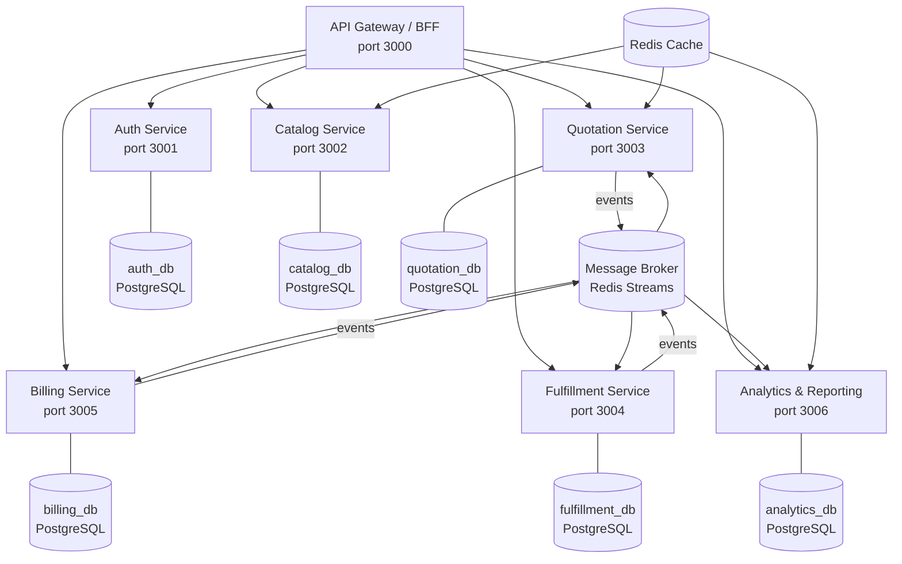
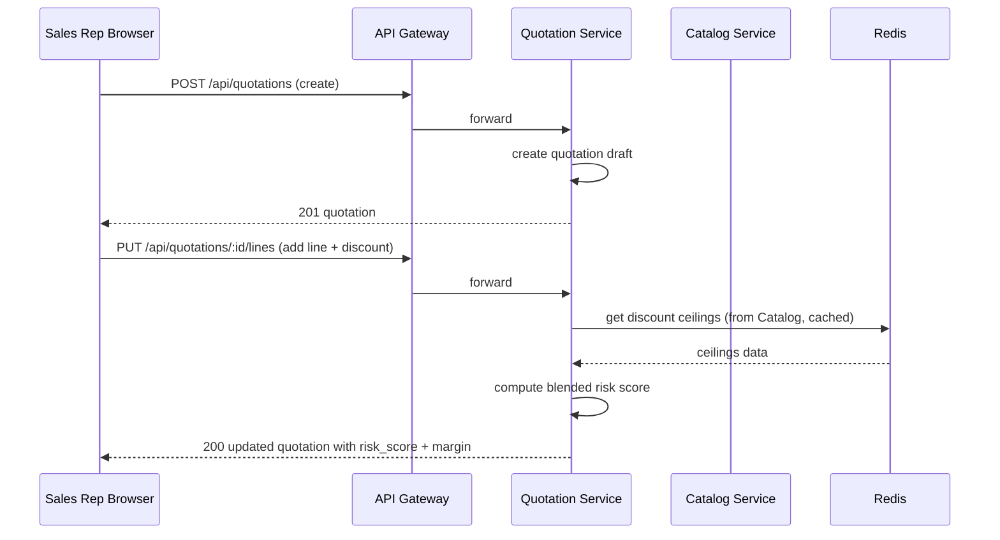
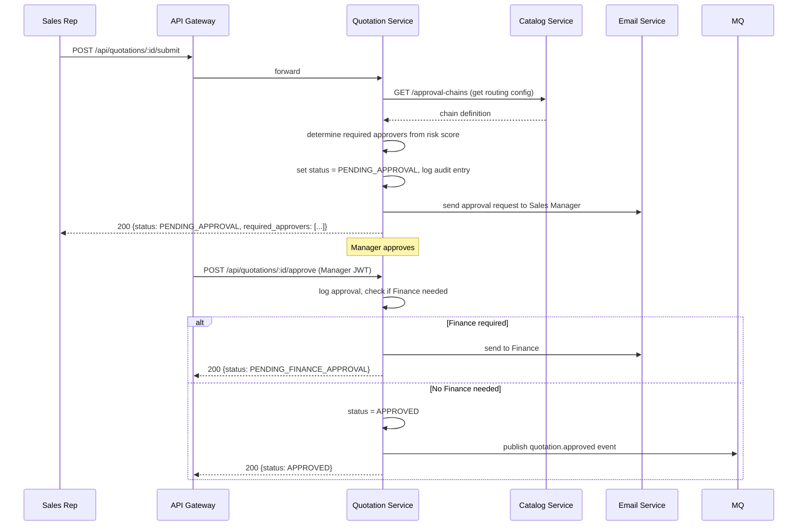
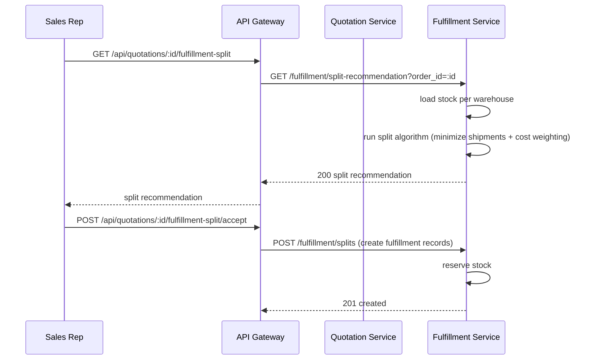
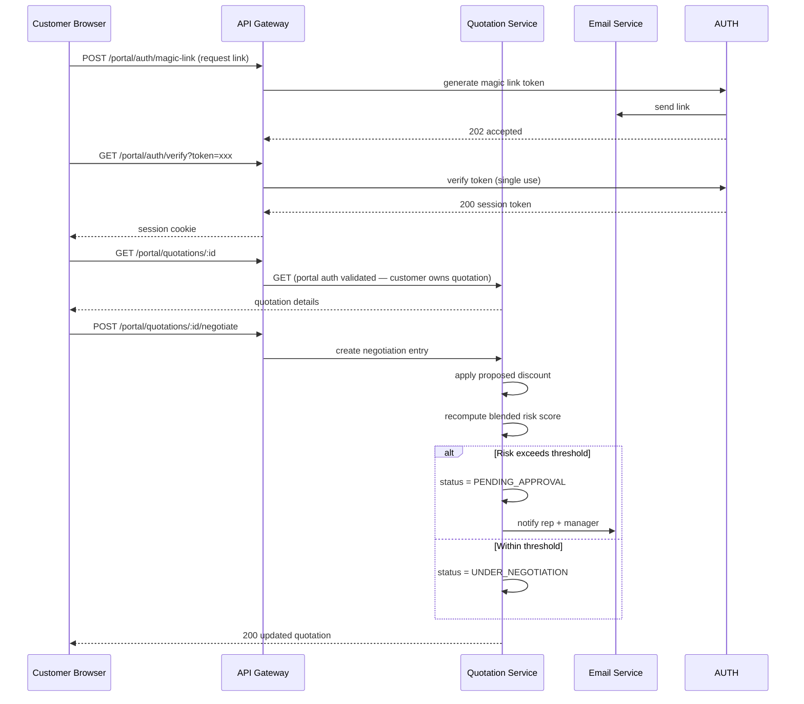
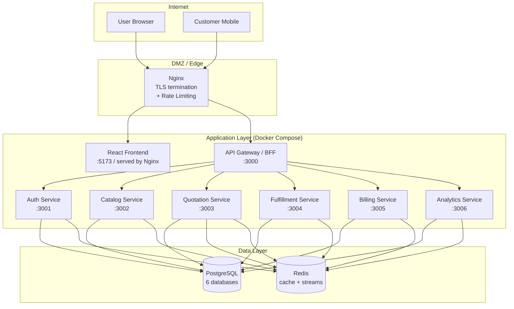

# DealFlow360 — Overall Architecture

---

## 1. System Purpose

DealFlow360 is an **Intelligent, Self-Governing Sales Operations Platform** for B2B sales teams. It handles the complete quotation-to-cash lifecycle:

- Multi-tier discount governance with automated approval routing
- Live upsell/cross-sell recommendations with real-time margin impact
- Multi-warehouse fulfillment splitting and backorder handling
- Hybrid billing (one-time products mixed with recurring subscriptions)
- Deal health monitoring and anomaly alerting
- Customer-facing portal negotiation on live quotations
- Sales backend configuration and reporting dashboards

---

## 2. System Context

---

## 3. Actors

| Actor | Type | Authentication |
|-------|------|---------------|
| Sales Rep | Internal | JWT (email + password) |
| Sales Manager | Internal | JWT (email + password) |
| Finance User | Internal | JWT (email + password) |
| Admin | Internal | JWT (email + password) |
| Customer | External | Magic Link OR email + password → session token |

---

## 4. Bounded Contexts & Microservices

The system is decomposed into **6 microservices** based on meaningful bounded contexts. No service is created arbitrarily.

### Why Each Service Exists

| Service | Reason for Existence |
|---------|---------------------|
| **Auth Service** | Security boundary — authentication logic must be isolated and independently deployable. Owns identity data. |
| **Catalog Service** | Independent business responsibility — products, price lists, discount tiers, upsell rules, and subscription plan configuration are backend admin concerns, not tied to the quotation lifecycle. |
| **Quotation Service** | Core domain — the quotation lifecycle (creation, approval routing, blended risk scoring, customer negotiation) is the largest bounded context. Owns quotation state machine. |
| **Fulfillment Service** | Separate data ownership — warehouse stock, splits, and backorders are physically independent of quoting. Requires independent scaling during high-volume periods. |
| **Billing Service** | Separate business responsibility — recurring billing, proration, invoicing, and credit notes are a distinct financial domain with independent compliance requirements. |
| **Analytics & Reporting** | Computational isolation — report aggregation, export generation, and deal health computation are read-heavy, potentially slow queries that must not block transactional services. |

---

## 5. Service Responsibilities Summary

### 5.1 Auth Service
- **Owns**: User accounts, sessions, magic link tokens
- **Does NOT own**: Business roles beyond authentication, quotation data
- **Scales**: Horizontally — stateless JWT validation

### 5.2 Catalog Service
- **Owns**: Products, variants, price lists, discount tiers, approval chain config, subscription plan definitions, upsell/cross-sell rules, warehouse configuration
- **Does NOT own**: Quotation state, stock levels (stock is in Fulfillment)
- **Scales**: Low traffic — admin configuration only

### 5.3 Quotation Service
- **Owns**: Quotations, quotation lines, approval logs, customer negotiation history
- **Does NOT own**: Product catalog data (reads from Catalog), warehouse stock (reads from Fulfillment), billing schedules (delegates to Billing)
- **Scales**: Horizontally — most write-intensive service

### 5.4 Fulfillment Service
- **Owns**: Warehouse stock levels, fulfillment splits, backorders
- **Does NOT own**: Quotation state, billing
- **Scales**: Horizontally — event-driven updates

### 5.5 Billing Service
- **Owns**: Invoices, subscription lines, billing schedules, credit notes, payment records
- **Does NOT own**: Quotation content, stock
- **Scales**: Horizontally — recurring billing jobs

### 5.6 Analytics & Reporting Service
- **Owns**: Pre-aggregated report views, deal health snapshots, export generation
- **Does NOT own**: Source-of-truth data (reads from other services via events or read replicas)
- **Scales**: Independently for reporting workloads

---

## 6. Frontend Architecture

The frontend is a **React SPA** (Single Page Application) composed of two distinct runtime contexts:

| Context | URL Prefix | Audience | Auth |
|---------|-----------|----------|------|
| **Internal Workspace** | `/app/*` | Sales Rep, Manager, Finance, Admin | JWT cookie/header |
| **Customer Portal** | `/portal/*` | Customer (Portal User) | Session token / magic link |

These are **not the same app with different labels** — they have separate routing trees, separate authentication flows, separate API clients, and the portal has no knowledge of internal workspace routes.

---

## 7. Major Synchronous Flows

### 7.1 Quotation Creation & Discount Risk Computation

### 7.2 Approval Routing

### 7.3 Warehouse Split

### 7.4 Customer Portal Negotiation

---

## 8. Major Asynchronous Flows

### Events via Redis Streams

| Event | Producer | Consumers | Purpose |
|-------|----------|-----------|---------|
| `quotation.approved` | Quotation | Fulfillment, Billing | Trigger split + invoice generation |
| `quotation.confirmed` | Quotation | Billing, Analytics | Trigger final invoice, update report data |
| `fulfillment.stock_arrived` | Fulfillment | Quotation | Trigger "Consolidate Backorder" prompt |
| `fulfillment.shipment_delayed` | Fulfillment | Analytics | Trigger delivery slippage alert |
| `billing.invoice_created` | Billing | Analytics | Update MRR/reporting |
| `billing.subscription_renewed` | Billing | Analytics | Update recurring revenue data |

---

## 9. API Gateway

- **Technology**: Nginx reverse proxy + custom BFF layer (Node.js/Express)
- **Responsibilities**: 
  - Route `/api/*` to internal services
  - Route `/portal/*` to portal-specific endpoints in Quotation and Auth services
  - JWT validation at gateway level (avoids repetition in each service)
  - Rate limiting (auth endpoints: 10 req/min; API: 100 req/min)
  - Request ID injection for tracing

---

## 10. Authentication & Authorization Summary

| Mechanism | Used By | Details |
|-----------|---------|---------|
| JWT Bearer Token | Internal users | HS256, 8-hour expiry, refresh tokens |
| Session Token (httpOnly cookie) | Customer portal | Opaque token, 7-day TTL, stored in Redis |
| Magic Link | Customer portal | UUID token, single-use, 24-hour TTL |
| Service-to-Service | Internal services | Shared secret header `X-Service-Token` |

**Authorization model**: Role-based with resource-ownership checks.

| Role | Quotation access | Approval access | Catalog config | Fulfillment | Billing | Reports |
|------|-----------------|-----------------|----------------|-------------|---------|---------|
| Admin | All | All | Full | View | View | Full |
| Sales Manager | Team's | Approve/Reject | View | View | View | Team |
| Finance | All | Approve/Reject (2nd level) | View | All | Full | Full |
| Sales Rep | Own | Submit | View | View | View | Own |
| Customer (Portal) | Own only | None | None | None | None | None |

---

## 11. Database Strategy

Each service owns its own PostgreSQL database. **No shared database**.

| Service | Database | Rationale |
|---------|----------|-----------|
| Auth | `auth_db` | Identity data must be isolated |
| Catalog | `catalog_db` | Product/config data, low churn |
| Quotation | `quotation_db` | High-write transactional core |
| Fulfillment | `fulfillment_db` | Stock and split data, separate domain |
| Billing | `billing_db` | Financial records, compliance isolation |
| Analytics | `analytics_db` | Read-optimized projections |

**Cross-service data needs** are satisfied via:
1. Synchronous API calls for real-time data (e.g. Quotation reads stock availability from Fulfillment)
2. Asynchronous events for eventual consistency (e.g. Analytics subscribes to quotation events)
3. Cached lookups for frequently-read catalog data (discount ceilings, product prices)

---

## 12. Caching Strategy

| Cache | Technology | TTL | Content |
|-------|-----------|-----|---------|
| Discount ceilings | Redis | 5 min | Per-tier + per-category ceilings |
| Product catalog | Redis | 10 min | Product list, prices |
| Upsell rules | Redis | 15 min | Suggestion rules |
| Portal session tokens | Redis | 7 days | Customer session |
| Magic link tokens | Redis | 24 hours | One-time portal access |
| Analytics snapshots | Redis | 1 min | Dashboard data |

---

## 13. Deployment Topology

**Deployment**: Docker Compose for hackathon (single `docker-compose.yml`). Production path: Kubernetes.

---

## 14. Network & Trust Boundaries

| Boundary | Description |
|----------|-------------|
| **Internet → Nginx** | Public internet, TLS enforced |
| **Nginx → Frontend** | Static file serving |
| **Nginx → Gateway** | Reverse proxy, only gateway exposed |
| **Gateway → Services** | Internal Docker network, not externally accessible |
| **Services → Databases** | Internal network, credentials via env vars |
| **Services → Redis** | Internal network |
| **Services → Email** | Outbound SMTP/HTTPS only |

---

## 15. Failure Modes & Resilience

| Failure | Mitigation |
|---------|-----------|
| Auth Service down | Gateway returns 503; no other service is affected |
| Catalog Service down | Quotation Service uses cached discount ceilings (5-min TTL) |
| Fulfillment Service down | Quotation can be approved; split calculation deferred; user sees degraded message |
| Billing Service down | Event queued in Redis Streams; processed when recovered |
| Analytics Service down | Dashboard shows stale data with last-update timestamp |
| Redis down | Services fall back to direct DB reads; performance degrades but correctness maintained |
| Message lost | Redis Streams with consumer groups + dead-letter handling |

---

## 16. Implementation Checkpoints — Architecture

**CHECK-ARCH-001**
- **Covers**: REQ-NF-008, REQ-SEC-002
- **Precondition**: All services deployed
- **Action**: Customer portal user (session token) attempts to call `/api/quotations` (internal endpoint)
- **Expected**: 401 or 403 response — portal session token rejected by internal auth
- **Verification**: Automated security test

**CHECK-ARCH-002**
- **Covers**: REQ-IMP-002
- **Precondition**: All services running
- **Action**: GET `/health` on each service port (3001–3006)
- **Expected**: HTTP 200 with `{status: "ok"}` from each
- **Verification**: Docker Compose healthcheck + automated test

**CHECK-ARCH-003**
- **Covers**: REQ-NF-007
- **Precondition**: System fully running with seed data
- **Action**: Run 20 concurrent quotation create requests
- **Expected**: All return 201 within 3s; no data corruption
- **Verification**: Load test script (k6 or Artillery)

**CHECK-ARCH-004**
- **Covers**: REQ-F-160, REQ-CON-005
- **Precondition**: System deployed with seed data
- **Action**: Execute complete end-to-end flow: create quotation → add lines → submit → approve → split → confirm → record payment
- **Expected**: Each step transitions to correct state; final invoice status is PAID
- **Verification**: Automated e2e test (Playwright)
