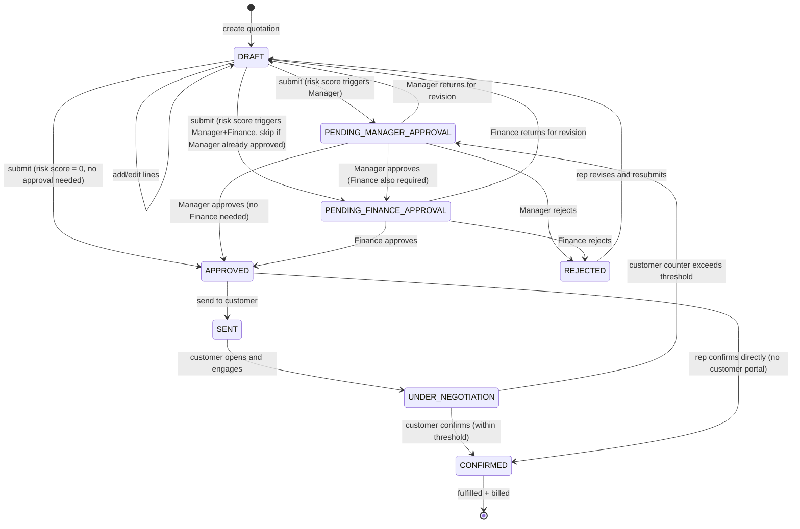

# DealFlow360 — Quotation Service

> **This is the core domain service** — the heart of DealFlow360. It owns the complete quotation lifecycle from creation through approval to confirmation.

---

## 1. Purpose

The Quotation Service manages the **entire quotation state machine**: creation, line management, blended risk score computation, approval routing, customer negotiation, and order confirmation. It is the most write-intensive and most critical service in the system.

---

## 2. Responsibilities

- Quotation CRUD (create, read, update, delete draft)
- Quotation line management (add, edit, remove lines)
- Blended discount risk score computation (the core business rule engine)
- Approval flow state machine (routing, tracking, audit logging)
- Customer negotiation intake from portal
- Quotation status machine transitions
- Upsell suggestion serving (combines Catalog rules + current cart context)
- Customer entity management (separate from Auth)
- Quotation confirmation → triggers Fulfillment + Billing events

---

## 3. Non-Responsibilities

- Product catalog data (reads from Catalog Service)
- Stock levels (reads from Fulfillment Service)
- Invoice generation (delegates to Billing Service via events)
- Warehouse definitions (reads from Catalog Service)
- User identity (reads from Auth Service JWT)

---

## 4. Requirements Implemented

| Requirement | Description |
|------------|-------------|
| REQ-F-024 | Blended risk score computation |
| REQ-F-025 | Route to highest required approval level |
| REQ-F-026 | Audit log all approvals/rejections |
| REQ-F-080–082 | Quotation list / pipeline view |
| REQ-F-090–097 | Quotation builder (products, quantities, discounts) |
| REQ-F-095 | Live margin indicator |
| REQ-F-100–103 | Approval screen and actions |
| REQ-F-110–115 | Upsell/cross-sell panel |
| REQ-F-140–146 | Customer portal negotiation |
| REQ-F-150–154 | Deal health data (served to Analytics) |
| REQ-F-160–162 | End-to-end flow completion |
| REQ-F-170–173 | Blended risk score algorithm |
| REQ-BR-001–008 | All quotation business rules |
| REQ-D-008–010 | Quotation, QuotationLine, ApprovalLog entities |
| REQ-D-018 | CustomerNegotiation entity |
| REQ-IMP-006 | Idempotency on confirmation |
| REQ-IMP-007 | Optimistic concurrency |

---

## 5. Quotation Status Machine



---

## 6. Database Schema

```prisma
// quotation-service/src/db/prisma/schema.prisma

datasource db {
  provider = "postgresql"
  url      = env("QUOTATION_DATABASE_URL")
}

enum QuotationStatus {
  DRAFT
  PENDING_MANAGER_APPROVAL
  PENDING_FINANCE_APPROVAL
  APPROVED
  SENT
  UNDER_NEGOTIATION
  CONFIRMED
  REJECTED
  LOST
}

enum ApprovalAction {
  APPROVE
  REJECT
  RETURN_FOR_REVISION
}

enum NegotiationStatus {
  PENDING
  ACCEPTED
  REJECTED
}

// ─────────────────────────────────────────────
// Customer (owned by Quotation Service)
// ─────────────────────────────────────────────

model Customer {
  id           String    @id @default(uuid())
  companyId    String    @default("default")
  name         String
  email        String
  tier         String    @default("BRONZE")  // BRONZE | SILVER | GOLD
  currency     String    @default("USD")
  hasPortalAccess Boolean @default(false)
  createdAt    DateTime  @default(now())
  updatedAt    DateTime  @updatedAt

  quotations   Quotation[]

  @@unique([companyId, email])
  @@index([companyId])
}

// ─────────────────────────────────────────────
// Quotation
// ─────────────────────────────────────────────

model Quotation {
  id                String          @id @default(uuid())
  companyId         String          @default("default")
  customerId        String
  repId             String          // userId from auth_db (logical FK)
  status            QuotationStatus @default(DRAFT)
  blendedRiskScore  Float           @default(0)
  totalAmount       Decimal         @db.Decimal(12, 4) @default(0)
  totalMarginPct    Float           @default(0)
  currency          String          @default("USD")
  notes             String?
  validUntil        DateTime?
  version           Int             @default(1)   // for optimistic locking
  lastActivityAt    DateTime        @default(now()) // for stall detection
  confirmedAt       DateTime?
  idempotencyKey    String?         @unique       // for duplicate confirmation prevention
  createdAt         DateTime        @default(now())
  updatedAt         DateTime        @updatedAt

  customer          Customer        @relation(fields: [customerId], references: [id])
  lines             QuotationLine[]
  approvalLogs      ApprovalLog[]
  negotiations      CustomerNegotiation[]

  @@index([companyId, status])
  @@index([companyId, repId])
  @@index([companyId, customerId])
  @@index([lastActivityAt])
}

// ─────────────────────────────────────────────
// Quotation Lines
// ─────────────────────────────────────────────

model QuotationLine {
  id              String    @id @default(uuid())
  quotationId     String
  productId       String    // logical FK to catalog_db.Product
  variantId       String?   // logical FK to catalog_db.ProductVariant
  productName     String    // snapshot at line creation time
  categoryId      String    // snapshot
  categoryName    String    // snapshot
  quantity        Int       @default(1)
  unitPrice       Decimal   @db.Decimal(12, 4)
  costPrice       Decimal   @db.Decimal(12, 4) @default(0)  // for margin
  discountPct     Float     @default(0)
  lineTotal       Decimal   @db.Decimal(12, 4)
  taxAmount       Decimal   @db.Decimal(12, 4) @default(0)
  marginPct       Float     @default(0)
  isRecurring     Boolean   @default(false)
  planId          String?   // if recurring, ref to catalog_db.SubscriptionPlan
  planInterval    String?   // snapshot: MONTHLY | QUARTERLY | YEARLY
  sortOrder       Int       @default(0)
  createdAt       DateTime  @default(now())
  updatedAt       DateTime  @updatedAt

  quotation       Quotation @relation(fields: [quotationId], references: [id], onDelete: Cascade)

  @@index([quotationId])
}

// ─────────────────────────────────────────────
// Approval Audit Log (IMMUTABLE — no updates/deletes)
// ─────────────────────────────────────────────

model ApprovalLog {
  id           String         @id @default(uuid())
  quotationId  String
  approverId   String         // userId from auth_db
  approverName String         // snapshot of user name at time of action
  approverRole String         // SALES_MANAGER | FINANCE
  action       ApprovalAction
  reason       String?        // required for REJECT and RETURN_FOR_REVISION
  riskScore    Float          // blended risk score at time of action
  createdAt    DateTime       @default(now())

  quotation    Quotation      @relation(fields: [quotationId], references: [id])

  @@index([quotationId])
  @@index([approverId])
}

// ─────────────────────────────────────────────
// Customer Negotiation
// ─────────────────────────────────────────────

model CustomerNegotiation {
  id               String            @id @default(uuid())
  quotationId      String
  customerId       String
  message          String?
  proposedDiscount Float?            // counter-discount proposal (overall %)
  lineComments     Json?             // { lineId: "comment text" }
  status           NegotiationStatus @default(PENDING)
  createdAt        DateTime          @default(now())
  resolvedAt       DateTime?

  quotation        Quotation         @relation(fields: [quotationId], references: [id])

  @@index([quotationId])
}
```

---

## 7. Blended Risk Score Algorithm

This is the **core business rule** of the system. Implement it as a pure function (easily testable, no side effects).

```typescript
// domain/services/risk-score.service.ts

interface LineRiskInput {
  lineId: string;
  categoryId: string;
  discountPct: number;
  quantity: number;
  lineTotal: number;
}

interface CeilingMap {
  tierCeiling: number;           // e.g. 15 for GOLD
  categoryCeilings: Record<string, number>;  // categoryId → ceiling
}

interface RiskScoreResult {
  blendedScore: number;          // 0–100+
  lineViolations: LineViolation[];
  requiresApproval: boolean;
  requiredRoles: string[];       // from approval chain config
}

interface LineViolation {
  lineId: string;
  categoryId: string;
  appliedDiscount: number;
  allowedCeiling: number;
  violationPoints: number;       // discountPct - ceiling (negative = within limit)
}

function computeBlendedRiskScore(
  lines: LineRiskInput[],
  ceilings: CeilingMap,
  totalOrderValue: number
): RiskScoreResult {
  const violations: LineViolation[] = [];
  let weightedViolationSum = 0;

  for (const line of lines) {
    // Effective ceiling = min(tierCeiling, categoryCeiling for this line's category)
    const categoryCeiling = ceilings.categoryCeilings[line.categoryId] ?? ceilings.tierCeiling;
    const effectiveCeiling = Math.min(ceilings.tierCeiling, categoryCeiling);
    
    const violationPoints = line.discountPct - effectiveCeiling;
    
    violations.push({
      lineId: line.lineId,
      categoryId: line.categoryId,
      appliedDiscount: line.discountPct,
      allowedCeiling: effectiveCeiling,
      violationPoints: violationPoints  // negative = compliant
    });

    if (violationPoints > 0) {
      // Weight violation by line's share of order value
      const lineWeight = totalOrderValue > 0 ? line.lineTotal / totalOrderValue : 0;
      weightedViolationSum += violationPoints * lineWeight;
    }
  }

  // Also check if any single line is badly violating (catches REQ-F-171)
  const worstSingleViolation = Math.max(...violations.map(v => Math.max(0, v.violationPoints)));

  // Blended score: weighted average violation + bonus points for worst offender
  // Score of 0 = perfectly within limits
  // Score of 100 = very high risk (e.g. one line 8 points over + others over too)
  const blendedScore = Math.min(100, weightedViolationSum * 10 + worstSingleViolation * 3);

  return {
    blendedScore,
    lineViolations: violations,
    requiresApproval: blendedScore > 0,
    requiredRoles: []  // populated by ApprovalChain lookup
  };
}
```

**Threshold Examples** (configurable via Catalog Service):
- Score 0: No approval required
- Score 0.1–30: Sales Manager approval required
- Score 30.1+: Sales Manager + Finance approval required

---

## 8. API Endpoints

### Customers

| Method | Path | Auth | Description |
|--------|------|------|-------------|
| GET | `/quotations/customers` | JWT | List customers |
| POST | `/quotations/customers` | JWT (ADMIN, SALES_REP) | Create customer |
| PUT | `/quotations/customers/:id` | JWT | Update customer |
| POST | `/quotations/customers/:id/portal-access` | JWT (ADMIN) | Grant portal access |

### Quotations (Internal)

| Method | Path | Auth | Description |
|--------|------|------|-------------|
| GET | `/quotations` | JWT | List quotations (paginated, filtered) |
| POST | `/quotations` | JWT (SALES_REP, ADMIN) | Create draft quotation |
| GET | `/quotations/:id` | JWT | Get full quotation |
| PUT | `/quotations/:id` | JWT | Update quotation metadata |
| DELETE | `/quotations/:id` | JWT (SALES_REP — own, ADMIN) | Delete draft |
| POST | `/quotations/:id/lines` | JWT | Add line to quotation |
| PUT | `/quotations/:id/lines/:lineId` | JWT | Update line (qty, discount) |
| DELETE | `/quotations/:id/lines/:lineId` | JWT | Remove line |
| GET | `/quotations/:id/risk-score` | JWT | Get computed blended risk score |
| GET | `/quotations/:id/upsell-suggestions` | JWT | Get ranked upsell suggestions for cart |
| POST | `/quotations/:id/submit` | JWT (SALES_REP) | Submit for approval or directly to approved |
| POST | `/quotations/:id/approve` | JWT (SALES_MANAGER, FINANCE) | Approve quotation |
| POST | `/quotations/:id/reject` | JWT (SALES_MANAGER, FINANCE) | Reject quotation |
| POST | `/quotations/:id/return` | JWT (SALES_MANAGER, FINANCE) | Return for revision |
| POST | `/quotations/:id/send` | JWT (SALES_REP, SALES_MANAGER) | Mark as SENT (send portal link) |
| POST | `/quotations/:id/confirm` | JWT (SALES_REP, ADMIN) | Confirm order |
| POST | `/quotations/:id/mark-lost` | JWT (SALES_REP) | Mark as LOST |
| GET | `/quotations/:id/approval-log` | JWT | Get full audit trail |
| GET | `/quotations/pipeline` | JWT | Get pipeline (Kanban) data |

### Portal (Customer)

| Method | Path | Auth | Description |
|--------|------|------|-------------|
| GET | `/portal/quotations/:id` | Portal session | View quotation |
| POST | `/portal/quotations/:id/negotiate` | Portal session | Submit negotiation (counter discount + comments) |
| POST | `/portal/quotations/:id/confirm` | Portal session | Customer confirms quotation |

---

## 9. Key Request/Response Schemas

### POST /quotations

**Request**:
```json
{
  "customerId": "uuid",
  "currency": "USD",
  "notes": "Annual software renewal",
  "validUntil": "2026-10-31"
}
```

**Response 201**:
```json
{
  "id": "uuid",
  "customer": { "id": "uuid", "name": "Acme Corp", "tier": "GOLD" },
  "repId": "uuid",
  "status": "DRAFT",
  "blendedRiskScore": 0,
  "totalAmount": "0.00",
  "totalMarginPct": 0,
  "currency": "USD",
  "lines": [],
  "createdAt": "2026-09-05T04:00:00Z"
}
```

### POST /quotations/:id/lines

**Request**:
```json
{
  "productId": "uuid",
  "variantId": "uuid",
  "quantity": 5,
  "discountPct": 12.0
}
```

**Response 200** (full updated quotation with risk score):
```json
{
  "id": "uuid",
  "status": "DRAFT",
  "blendedRiskScore": 18.5,
  "totalAmount": "5720.00",
  "totalMarginPct": 28.3,
  "lines": [
    {
      "id": "uuid",
      "productName": "Enterprise Laptop Pro",
      "categoryName": "Hardware",
      "quantity": 5,
      "unitPrice": "1299.00",
      "discountPct": 12.0,
      "lineTotal": "5720.00",
      "marginPct": 28.3,
      "isRecurring": false
    }
  ],
  "lineViolations": [
    {
      "lineId": "uuid",
      "categoryId": "uuid",
      "appliedDiscount": 12.0,
      "allowedCeiling": 15.0,
      "violationPoints": -3.0
    }
  ]
}
```

### POST /quotations/:id/submit

**Response 200**:
```json
{
  "id": "uuid",
  "status": "PENDING_MANAGER_APPROVAL",
  "blendedRiskScore": 45.2,
  "approvalRequired": true,
  "requiredApprovers": ["SALES_MANAGER"],
  "approvalLog": []
}
```

### POST /quotations/:id/approve

**Request** (SALES_MANAGER or FINANCE):
```json
{
  "reason": "Margins acceptable for strategic account"
}
```

**Response 200**:
```json
{
  "id": "uuid",
  "status": "APPROVED",
  "approvalLog": [
    {
      "id": "uuid",
      "approverName": "Jane Manager",
      "approverRole": "SALES_MANAGER",
      "action": "APPROVE",
      "reason": "Margins acceptable for strategic account",
      "createdAt": "2026-09-05T05:00:00Z"
    }
  ]
}
```

### POST /quotations/:id/reject

**Request**:
```json
{
  "reason": "Discount exceeds acceptable margin for this product category"
}
```

**Validation**: `reason` is required on reject and return-for-revision.

### GET /quotations/:id/upsell-suggestions

**Response 200**:
```json
{
  "suggestions": [
    {
      "suggestedProductId": "uuid",
      "suggestedProduct": {
        "id": "uuid",
        "name": "ProSupport 1yr Warranty",
        "basePrice": "299.00"
      },
      "marginDeltaIfAdded": "+4.2%",
      "isPromoted": true,
      "promotionTag": "🔥 Hot Deal"
    }
  ]
}
```

### POST /portal/quotations/:id/negotiate

**Request** (portal session auth):
```json
{
  "message": "We would like to discuss a higher discount on the Setup Service line",
  "proposedDiscount": 22.0,
  "lineComments": {
    "line-uuid-1": "Can you improve this price?",
    "line-uuid-2": "This price is acceptable"
  }
}
```

**Response 200**:
```json
{
  "id": "uuid",
  "status": "UNDER_NEGOTIATION",
  "negotiationId": "uuid",
  "message": "Your request has been submitted. The sales team will review and respond.",
  "reEnteredApproval": false
}
```

If proposed discount triggers risk re-evaluation:
```json
{
  "status": "PENDING_MANAGER_APPROVAL",
  "reEnteredApproval": true,
  "message": "The requested discount requires additional approval. We will notify you once reviewed."
}
```

### POST /portal/quotations/:id/confirm

**Request**: `{}` (customer confirms current terms)

**Response 200**:
```json
{
  "id": "uuid",
  "status": "CONFIRMED",
  "confirmedAt": "2026-09-05T06:00:00Z",
  "message": "Order confirmed. You will receive fulfillment and billing information shortly."
}
```

---

## 10. Events Published

| Event | Trigger | Payload |
|-------|---------|---------|
| `quotation.approved` | Status → APPROVED | `{ quotationId, customerId, repId, lines[], totalAmount, currency }` |
| `quotation.confirmed` | Status → CONFIRMED | `{ quotationId, customerId, repId, lines[], totalAmount, currency, confirmedAt }` |
| `quotation.rejected` | Status → REJECTED | `{ quotationId, customerId, repId, reason }` |
| `quotation.negotiation_received` | Customer submits negotiation | `{ quotationId, customerId, proposedDiscount }` |
| `quotation.status_changed` | Any status change | `{ quotationId, oldStatus, newStatus, timestamp }` |

---

## 11. Events Consumed

| Event | Source | Action |
|-------|--------|--------|
| `fulfillment.stock_arrived` | Fulfillment | Trigger "Consolidate Backorder" prompt on relevant quotation |
| `fulfillment.shipment_delayed` | Fulfillment | Update `lastActivityAt`, trigger deal health recalculation |

---

## 12. Idempotency

- `POST /quotations/:id/confirm` accepts an `Idempotency-Key` header
- Key stored in `idempotencyKey` field on Quotation
- Duplicate confirmation requests with same key return 200 with existing confirmed state
- Prevents double-billing when network retries occur

---

## 13. Optimistic Concurrency

- Quotation has a `version` integer field
- All update operations (add line, update line, submit) require `version` in request
- If DB version ≠ request version, return `409 CONFLICT`
- Frontend increments version after each successful mutation

---

## 14. Quotation Access Control

| Role | Can access | Can modify |
|------|-----------|-----------|
| ADMIN | All quotations | All |
| SALES_MANAGER | All quotations (team view) | Approve/reject/return |
| FINANCE | All quotations | Approve/reject/return (finance level only) |
| SALES_REP | Own quotations only | Own DRAFT quotations |
| Customer (Portal) | Own quotation only | Negotiate, confirm |

---

## 15. Unit Tests

```typescript
// risk-score.service.test.ts
describe('computeBlendedRiskScore', () => {
  it('returns score=0 when all lines within ceilings');
  it('returns positive score when single line exceeds category ceiling');
  it('captures cumulative violations across multiple slightly-over lines');
  it('returns higher score when more lines are violated');
  it('correctly handles Gold tier with Hardware (15%) and Service (10%) ceilings');
  it('example from PDF: Hardware 12% (allowed 15%) = compliant; Service 18% (allowed 10%) = violation');
  it('handles zero-value order gracefully');
  it('handles lines with 0% discount (always compliant)');
});

describe('QuotationService', () => {
  describe('computeAndUpdateRiskScore', () => {
    it('fetches ceilings from Catalog, computes score, updates quotation');
    it('determines correct requiredRoles from ApprovalChain');
  });

  describe('submitForApproval', () => {
    it('moves to PENDING_MANAGER_APPROVAL when score triggers manager');
    it('moves to APPROVED immediately when score is 0');
    it('throws when quotation is not in DRAFT status');
  });

  describe('approve', () => {
    it('SALES_MANAGER approval with Finance required → PENDING_FINANCE_APPROVAL');
    it('SALES_MANAGER approval without Finance required → APPROVED');
    it('FINANCE approval → APPROVED');
    it('throws INSUFFICIENT_ROLE when SALES_REP tries to approve');
    it('throws when quotation not in correct pending status');
  });

  describe('portal negotiate', () => {
    it('applies proposed discount and recomputes risk score');
    it('re-enters approval flow when new risk score exceeds threshold');
    it('stays UNDER_NEGOTIATION when new terms are within threshold');
    it('throws when customer does not own quotation');
  });
});
```

---

## 16. Integration Tests

```typescript
describe('Quotation API', () => {
  it('CHECK-QUOT-001: full quotation lifecycle — create, add lines, submit, approve, confirm');
  it('CHECK-QUOT-002: blended risk triggers correct approval routing');
  it('CHECK-QUOT-003: portal customer can negotiate; rep sees negotiation');
  it('CHECK-QUOT-004: customer negotiation re-triggers approval when thresholds exceeded');
  it('CHECK-QUOT-005: optimistic concurrency conflict returns 409');
  it('CHECK-QUOT-006: idempotent confirmation prevents duplicate processing');
  it('CHECK-QUOT-007: SALES_REP cannot access another rep\'s quotation');
  it('CHECK-QUOT-008: portal customer cannot access another customer\'s quotation');
});
```

---

## 17. Implementation Checkpoints

**CHECK-QUOT-001**
- **Covers**: REQ-F-090–097, REQ-F-160
- **Precondition**: Rep logged in, customer exists, products in catalog
- **Action**: Create quotation → add Hardware line (12% discount, ceiling 15%) → add Service line (18% discount, ceiling 10%)
- **Expected**: Risk score > 0; status change to DRAFT; blendedRiskScore field shows computed value
- **Test**: `quotation.api.test.ts > full lifecycle`

**CHECK-QUOT-002**
- **Covers**: REQ-F-024, REQ-F-025, REQ-BR-005
- **Precondition**: Quotation with Service line at 18% (ceiling 10%)
- **Action**: `POST /quotations/:id/submit`
- **Expected**: Status → PENDING_MANAGER_APPROVAL (or PENDING_FINANCE_APPROVAL if score > 30); no manual routing needed
- **Test**: `quotation.api.test.ts > submit triggers approval`

**CHECK-QUOT-003**
- **Covers**: REQ-F-102, REQ-F-103, REQ-F-026, REQ-BR-017
- **Precondition**: Quotation in PENDING_MANAGER_APPROVAL
- **Action**: `POST /quotations/:id/reject` with reason
- **Expected**: Status → REJECTED; ApprovalLog entry created with action=REJECT, reason, timestamp, approverName
- **Test**: `quotation.api.test.ts > rejection creates audit log`

**CHECK-QUOT-004**
- **Covers**: REQ-F-142, REQ-F-145, REQ-BR-008
- **Precondition**: Quotation in SENT status; customer has portal access
- **Action**: Customer submits negotiation with proposedDiscount=25% (exceeds thresholds)
- **Expected**: Status → PENDING_MANAGER_APPROVAL; rep + manager notified
- **Test**: `quotation.api.test.ts > portal negotiation re-enters approval`

**CHECK-QUOT-005**
- **Covers**: REQ-F-144, REQ-F-146
- **Precondition**: Quotation APPROVED or UNDER_NEGOTIATION (within threshold)
- **Action**: Customer confirms via portal
- **Expected**: Status → CONFIRMED; `quotation.confirmed` event published
- **Test**: `quotation.api.test.ts > customer confirmation`

**CHECK-QUOT-006**
- **Covers**: REQ-IMP-006
- **Precondition**: Quotation in APPROVED state
- **Action**: Send `POST /quotations/:id/confirm` twice with same Idempotency-Key
- **Expected**: Both return 200; quotation confirmed only once; no duplicate events
- **Test**: `quotation.api.test.ts > idempotent confirmation`

**CHECK-QUOT-007**
- **Covers**: REQ-F-095, REQ-PERF-001
- **Precondition**: Quotation with lines
- **Action**: Update line discount; measure response time
- **Expected**: Response includes updated `blendedRiskScore` and `totalMarginPct`; response time < 500ms
- **Test**: `quotation.api.test.ts > live margin update`
