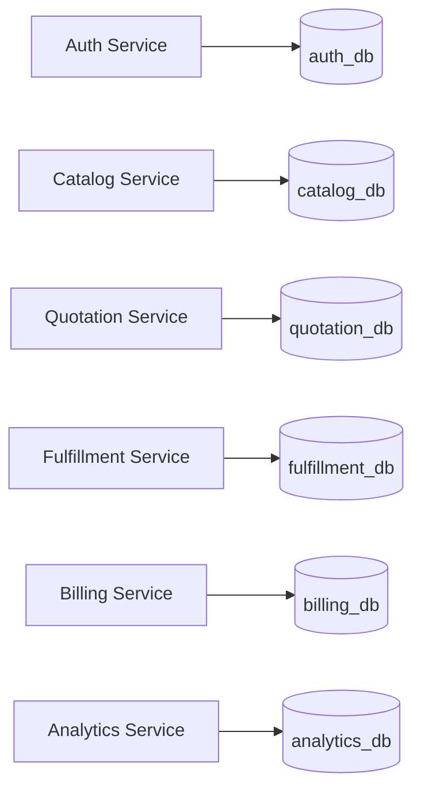

# DealFlow360 — Data Architecture

---

## 1. Database Ownership Model

Each microservice owns its own PostgreSQL database. No service reads directly from another service's database. Cross-service data needs are resolved via:
1. **Synchronous API calls** — for real-time data
2. **Events** — for eventual consistency projections
3. **Snapshots** — denormalized copies at time of action (e.g., product name in QuotationLine)



---

## 2. Data Classification

| Classification | Description | Examples |
|---------------|-------------|---------|
| **Authoritative** | Source of truth; only the owning service writes it | Quotation status, Invoice amount, Stock level |
| **Derived** | Computed from authoritative data; recalculated on demand | Blended risk score, Line total, Proration amount |
| **Snapshot** | Authoritative data captured at a point in time; never updated | productName in QuotationLine, approverName in ApprovalLog |
| **Cached** | Temporary copy of authoritative data for performance | Discount ceilings in Redis, Catalog data |
| **Projection** | Eventual-consistency replica for read-optimized queries | QuotationSnapshot in analytics_db |
| **Temporary** | Short-lived, purged after use | Magic link tokens (Redis, 24h TTL) |

---

## 3. auth_db Schema

```sql
-- Users
CREATE TABLE "User" (
  id           UUID PRIMARY KEY DEFAULT gen_random_uuid(),
  email        VARCHAR(255) UNIQUE NOT NULL,
  password_hash VARCHAR(255) NOT NULL,
  name         VARCHAR(100) NOT NULL,
  role         VARCHAR(20) NOT NULL CHECK (role IN ('ADMIN','SALES_MANAGER','FINANCE','SALES_REP')),
  is_active    BOOLEAN DEFAULT TRUE,
  created_at   TIMESTAMPTZ DEFAULT NOW(),
  updated_at   TIMESTAMPTZ DEFAULT NOW()
);
CREATE INDEX idx_user_email ON "User"(email);

-- Refresh Tokens
CREATE TABLE "RefreshToken" (
  id         UUID PRIMARY KEY DEFAULT gen_random_uuid(),
  user_id    UUID NOT NULL REFERENCES "User"(id) ON DELETE CASCADE,
  token_hash VARCHAR(255) UNIQUE NOT NULL,
  expires_at TIMESTAMPTZ NOT NULL,
  created_at TIMESTAMPTZ DEFAULT NOW(),
  revoked_at TIMESTAMPTZ
);
CREATE INDEX idx_rt_user ON "RefreshToken"(user_id);
CREATE INDEX idx_rt_hash ON "RefreshToken"(token_hash);

-- Customer Portal Credentials
CREATE TABLE "CustomerPortalCredential" (
  id            UUID PRIMARY KEY DEFAULT gen_random_uuid(),
  customer_id   UUID UNIQUE NOT NULL,  -- logical FK to quotation_db.Customer
  email         VARCHAR(255) UNIQUE NOT NULL,
  password_hash VARCHAR(255),          -- nullable: magic-link-only customers
  is_active     BOOLEAN DEFAULT TRUE,
  created_at    TIMESTAMPTZ DEFAULT NOW(),
  updated_at    TIMESTAMPTZ DEFAULT NOW()
);
CREATE INDEX idx_cpc_email ON "CustomerPortalCredential"(email);
```

**Redis Keys in auth context**:
```
magic_link:<uuid>         → JSON { customerId, email, used }   TTL: 86400s
portal_session:<token>    → JSON { customerId, email }          TTL: 604800s
rate_limit:login:<ip>     → counter                             TTL: 60s
rate_limit:magic:<email>  → counter                             TTL: 60s
```

---

## 4. catalog_db Schema Summary

> Full Prisma schema in `04-catalog-service.md`

**Tables**: `ProductCategory`, `Product`, `ProductVariant`, `PriceList`, `PriceListRule`, `DiscountTier`, `ApprovalChain`, `WarehouseDefinition`, `SubscriptionPlan`, `ProductPlanLink`, `UpsellRule`

**Key design decisions**:
- All entities have `companyId` for multi-tenant support (REQ-BONUS-002)
- `Product.costPrice` stored for margin calculations in Quotation Service
- Catalog data is **read-heavy**, so indexes on `(companyId, ...)` composites
- Warehouse definitions here; stock levels in fulfillment_db

**Important indexes**:
```sql
CREATE INDEX idx_product_company_category ON "Product"(company_id, category_id);
CREATE INDEX idx_pricelist_tier ON "PriceList"(company_id, customer_tier);
CREATE INDEX idx_discount_tier ON "DiscountTier"(company_id, customer_tier, category_id);
CREATE INDEX idx_upsell_trigger ON "UpsellRule"(company_id, trigger_product_id) WHERE is_active = true;
```

---

## 5. quotation_db Schema Summary

> Full Prisma schema in `05-quotation-service.md`

**Tables**: `Customer`, `Quotation`, `QuotationLine`, `ApprovalLog`, `CustomerNegotiation`

**Key design decisions**:
- `Quotation.version` for optimistic concurrency (avoids lost updates with concurrent rep edits)
- `Quotation.lastActivityAt` for stall detection (indexed)
- `Quotation.idempotencyKey` for confirmation deduplication
- `QuotationLine` snapshots `productName`, `categoryName` — not foreign keys to catalog_db — so quote history survives product renames
- `ApprovalLog` is **immutable**: no UPDATE or DELETE ever runs on this table
- `Customer.hasPortalAccess` gate (must be explicitly granted before portal link works)

**Critical indexes**:
```sql
CREATE INDEX idx_quot_company_status ON "Quotation"(company_id, status);
CREATE INDEX idx_quot_rep ON "Quotation"(company_id, rep_id);
CREATE INDEX idx_quot_activity ON "Quotation"(last_activity_at);
CREATE INDEX idx_quot_customer ON "Quotation"(company_id, customer_id);
CREATE INDEX idx_line_quot ON "QuotationLine"(quotation_id);
CREATE INDEX idx_alog_quot ON "ApprovalLog"(quotation_id);
```

---

## 6. fulfillment_db Schema Summary

> Full Prisma schema in `06-fulfillment-service.md`

**Tables**: `WarehouseStock`, `FulfillmentOrder`, `FulfillmentSplit`, `BackorderRecord`

**Key design decisions**:
- `WarehouseStock` uses UNIQUE constraint on `(companyId, warehouseId, productId, variantId)` — prevents duplicate stock rows
- `quantityReserved` updated atomically when fulfillment is accepted — prevents overselling
- `BackorderRecord` tracks outstanding quantities — triggers consolidate prompt when stock arrives
- `FulfillmentSplit.warehouseName` snapshot to preserve history if warehouse is renamed

**Stock reservation integrity**:
```sql
-- Atomically reserve stock
UPDATE "WarehouseStock"
SET quantity_reserved = quantity_reserved + :reserve_qty
WHERE warehouse_id = :wh_id AND product_id = :prod_id
  AND (quantity_on_hand - quantity_reserved) >= :reserve_qty;
-- If 0 rows updated → insufficient available stock → backorder
```

---

## 7. billing_db Schema Summary

> Full Prisma schema in `07-billing-service.md`

**Tables**: `Invoice`, `InvoiceLine`, `SubscriptionLine`, `BillingCycle`, `Payment`

**Key design decisions**:
- `Invoice.idempotencyKey` prevents duplicate invoice creation from retry storms
- `Payment.idempotencyKey` prevents double payment recording
- `SubscriptionLine.nextBillingDate` is the cursor used by the billing cron job
- `BillingCycle` provides complete billing history per subscription
- One-time invoice and subscription lines for same order linked via `orderId`

**Cron job query**:
```sql
SELECT * FROM "SubscriptionLine"
WHERE status = 'ACTIVE'
  AND next_billing_date <= NOW()
ORDER BY next_billing_date ASC;
```

---

## 8. analytics_db Schema Summary

> Full Prisma schema in `08-analytics-service.md`

**Tables**: `QuotationSnapshot`, `QuotationLineSnapshot`, `DealHealthConfig`, `DealAlert`, `NudgeAction`, `InvoiceSnapshot`, `SubscriptionSnapshot`

**Key design decisions**:
- All data is **derived** — analytics_db holds no authoritative data
- Snapshots populated by consuming events from Redis Streams
- `DealAlert` uses upsert to avoid duplicate alerts for same quotation
- `DealHealthConfig` is configurable per company — not hardcoded thresholds
- Analytics DB optimized for read: wider rows, fewer joins, pre-aggregated fields

---

## 9. Cross-Service Data Flows

### Quotation Line Creation (Real-Time Sync)

```
Frontend → Quotation Service
  → Quotation Service calls Catalog Service: GET /catalog/products/:id (with Redis cache)
  → Quotation Service calls Catalog Service: GET /catalog/discount-tiers/ceilings (cached 5min)
  → Compute risk score locally
  → Store line with product name/category snapshots in quotation_db
  → Return updated quotation
```

### Quotation Confirmation (Event-Driven)

```
Quotation Service → publishes quotation.confirmed event

Billing Service consumes:
  → Reads lines from event payload
  → Creates Invoice (ONE_TIME) for non-recurring lines
  → Creates SubscriptionLine for recurring lines
  → Stores in billing_db

Fulfillment Service consumes:
  → Makes order available for split recommendation

Analytics Service consumes:
  → Updates QuotationSnapshot
  → Updates InvoiceSnapshot
```

---

## 10. Data Retention & Audit

| Data Type | Retention | Notes |
|-----------|-----------|-------|
| ApprovalLog | Forever | Compliance; immutable |
| Quotation | Forever | Sales history |
| Invoice | Forever | Financial compliance |
| Payment | Forever | Financial compliance |
| BillingCycle | Forever | Billing history |
| Magic link tokens | 24 hours (Redis TTL) | Auto-purged |
| Portal sessions | 7 days (Redis TTL) | Auto-purged |
| RefreshToken (revoked) | 30 days | Purged by cleanup job |
| Analytics snapshots | 2 years | Reporting history |
| DealAlert (resolved) | 1 year | Historical |

---

## 11. Migration Strategy

Each service manages its own migrations via Prisma Migrate:

```bash
# Development
cd services/quotation-service
npx prisma migrate dev --name <migration_name>

# Production
npx prisma migrate deploy
```

**Migration rules**:
1. Migrations are **additive** — never delete columns directly; deprecate then drop after 2 releases
2. Never rename a column; add new + backfill + remove old
3. New NOT NULL columns must have a default value
4. Index creation uses `CREATE INDEX CONCURRENTLY` in production (Prisma wraps this)
5. All migrations reviewed before merge

---

## 12. Seed Data

Each service has a `src/db/seed.ts` script with realistic demo data:

### auth_db seed
```typescript
// 1 Admin, 2 Sales Managers, 1 Finance User, 3 Sales Reps, 5 Customers (portal credentials)
```

### catalog_db seed
```typescript
// 3 Categories: Hardware, Services, Subscriptions
// 10 Products across categories
// 3 Price Lists (BRONZE/SILVER/GOLD in USD; GOLD in EUR)
// Discount tiers: BRONZE→5%, SILVER→10%, GOLD→15%; Services category→10%
// Approval chains: score 0→no approval; 0.1-30→Manager; 30+→Manager+Finance
// 2 Warehouses: Main (weight 1.0), East Depot (weight 1.3)
// 2 Subscription Plans: ProSupport Monthly ($49.99), Annual ($499.00)
// 5 Upsell rules with margin thresholds
```

### quotation_db seed
```typescript
// 5 Customers: Acme Corp (GOLD), Beta Industries (SILVER), Gamma LLC (BRONZE), etc.
// 8 Sample quotations in various statuses covering all workflow stages
// 15+ Quotation lines showing hardware + service + subscription mixes
// Sample approval logs for demonstration
```

### fulfillment_db seed
```typescript
// Stock levels: 50 units per product in Main; 30 per product in East Depot
```

### billing_db seed
```typescript
// Invoices for confirmed orders; 2 active subscriptions; payment records
```

---

## 13. Implementation Checkpoints — Data Architecture

**CHECK-DATA-001**
- **Covers**: REQ-IMP-003
- **Precondition**: Prisma schemas written for all services
- **Action**: Run `npx prisma migrate dev` in each service directory
- **Expected**: All migrations complete without error; tables created with correct columns
- **Verification**: `npx prisma db pull` and compare with schema

**CHECK-DATA-002**
- **Covers**: REQ-NF-003, REQ-CON-004
- **Precondition**: Services running
- **Action**: Run seed scripts for all services
- **Expected**: Each DB has non-zero rows; relational integrity maintained
- **Verification**: SQL count queries; seed completion logs

**CHECK-DATA-003**
- **Covers**: REQ-SEC-008, REQ-BR-017
- **Precondition**: Approval action performed
- **Action**: Attempt `UPDATE "ApprovalLog" SET action = 'APPROVE'` directly in DB
- **Expected**: No service code path allows UPDATE/DELETE on ApprovalLog; Prisma client has no `update` repository method for this model
- **Verification**: Code audit; no `approvalLog.update()` call exists in codebase

**CHECK-DATA-004**
- **Covers**: REQ-IMP-007
- **Precondition**: Quotation at version=5
- **Action**: Two concurrent requests to add a line to same quotation, both with version=5
- **Expected**: One succeeds (returns version=6); other returns 409 CONCURRENCY_CONFLICT
- **Verification**: Automated concurrency test

**CHECK-DATA-005**
- **Covers**: Cross-service data integrity
- **Precondition**: Product renamed in catalog_db after quotation line created
- **Action**: `GET /api/v1/quotations/:id`
- **Expected**: QuotationLine still shows original product name (snapshot preserved)
- **Verification**: Integration test: rename product → verify old quotation unaffected
