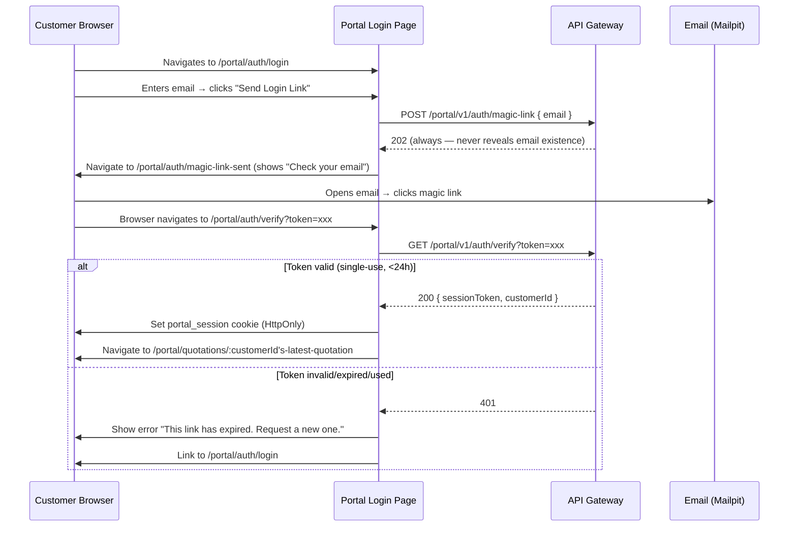

# DealFlow360 — Frontend: Customer Portal

> **Critical requirement (REQ-F-008, REQ-CON-003)**: The customer portal is a genuinely separate, restricted view. It shares zero route space, zero auth state, and zero component logic with the internal workspace.

---

## 1. Portal Overview

The customer portal allows B2B customers to:
- View their quotation details
- Submit line-level comments and change requests
- Propose a counter-discount
- Confirm the quotation (accept final terms)

It is accessed via:
1. A magic link sent by the sales rep via email
2. Email + password (for returning customers with set credentials)

---

## 2. Portal Routes

All under `/portal/*` — completely separate from `/app/*`:

| Route | Page | Auth |
|-------|------|------|
| `/portal/auth/login` | `PortalLoginPage` | None |
| `/portal/auth/magic-link-sent` | `MagicLinkSentPage` | None |
| `/portal/auth/verify?token=xxx` | `MagicLinkVerifyPage` | None (processes token) |
| `/portal/quotations/:id` | `QuotationPortalPage` | Portal session required |

---

## 3. Portal Auth Flow

### Magic Link Flow



### Portal Session Auth Guard

```typescript
// PortalAuthGuard.tsx
export function PortalAuthGuard({ children }: { children: ReactNode }) {
  const { isAuthenticated, isLoading } = usePortalAuth();
  
  if (isLoading) return <LoadingSpinner />;
  if (!isAuthenticated) return <Navigate to="/portal/auth/login" replace />;
  return <>{children}</>;
}

// usePortalAuth hook:
// On mount: call GET /portal/v1/auth/me (session cookie sent automatically)
// 200 → authenticated
// 401 → not authenticated → redirect to login
```

---

## 4. Portal Pages

### `PortalLoginPage.tsx`

```tsx
// TWO login methods:
// 1. Magic Link (default tab): email input → "Send Login Link" → POST /portal/v1/auth/magic-link
// 2. Email + Password (secondary tab): email + password → POST /portal/v1/auth/login

// Form states:
// - Default: email input with tabs
// - Loading: button disabled, spinner
// - Magic link sent: auto-navigate to MagicLinkSentPage
// - Password login success: navigate to /portal/quotations/:id

// NEVER show internal workspace links or branding
// Simple, clean, customer-facing design
```

### `MagicLinkSentPage.tsx`

```tsx
// Static confirmation page:
// "✉️ Check your email"
// "We sent a secure login link to <email@masked>"
// "The link expires in 24 hours."
// "Didn't receive it?" → "Resend" link (re-triggers magic link flow)
```

### `MagicLinkVerifyPage.tsx`

```tsx
// On mount: read ?token= from URL → POST /portal/v1/auth/verify
// Loading: full-page spinner "Verifying your link..."
// Success: set cookie → navigate to quotation
// Error 401: "This link has expired or has already been used."
//   → Button: "Request a new login link" → /portal/auth/login
```

### `QuotationPortalPage.tsx`

This is the **main customer-facing page**.

```tsx
// API: GET /portal/v1/quotations/:id
// Customer-only auth via portal session cookie
// Read-only display of quotation details + negotiation panel
```

**Layout**:
```
┌────────────────────────────────────────────────────┐
│ Header: DealFlow360 logo | Quotation #XXXX | Status │
│ Customer: Acme Corp | Valid Until: 31 Oct 2026      │
├────────────────────────────────────────────────────┤
│ Quotation Summary (read-only)                       │
│ ┌────────────────────────────────────────────────┐ │
│ │ Line Items Table (read-only)                   │ │
│ │ Product | Qty | Unit Price | Discount | Total  │ │
│ │ Laptop  |  5  |  $1,299   |   12%    | $5,720 │ │
│ │ Support |  5  |  $49.99   |    0%    |  $249  │ │
│ └────────────────────────────────────────────────┘ │
│ Subtotal: $5,969 | Tax: $1,074 | Total: $7,043      │
├────────────────────────────────────────────────────┤
│ Negotiation Panel                                   │
│ ┌────────────────────────────────────────────────┐ │
│ │ [Message] Overall counter discount: [___]%     │ │
│ │ Line Comments (per line)                       │ │
│ │ [Submit Request]  [Confirm Quotation ✓]        │ │
│ └────────────────────────────────────────────────┘ │
├────────────────────────────────────────────────────┤
│ Negotiation History (previous submissions)          │
└────────────────────────────────────────────────────┘
```

---

## 5. Portal Components

### `PortalQuotationHeader`

```tsx
interface PortalQuotationHeaderProps {
  quotationId: string;
  customerName: string;
  status: 'SENT' | 'UNDER_NEGOTIATION' | 'CONFIRMED' | 'PENDING_MANAGER_APPROVAL';
  validUntil: string | null;
  totalAmount: string;
  currency: string;
}

// Status badge mapping:
// SENT → "Awaiting Your Review" (blue)
// UNDER_NEGOTIATION → "Under Negotiation" (yellow)
// PENDING_MANAGER_APPROVAL → "Being Reviewed by Sales Team" (orange)
// CONFIRMED → "Order Confirmed ✓" (green)

// CONFIRMED state: full page banner "Thank you! Your order is confirmed."
```

### `PortalLineItemsTable`

```tsx
interface PortalLineItemsTableProps {
  lines: PortalQuotationLine[];
  lineComments: Record<string, string>;  // lineId → comment
  onCommentChange: (lineId: string, comment: string) => void;
  isConfirmed: boolean;  // read-only when confirmed
}

// Table columns:
// | Product Name | Description | Qty | Unit Price | Discount | Total |
//
// Per line (when status allows negotiation):
//   Comment input below each row: "Add a comment about this line..."
//   Character limit: 500
```

### `NegotiationForm`

```tsx
interface NegotiationFormData {
  message: string;              // max 1000 chars
  proposedDiscount: number | null;  // 0–100, null if not proposing
  lineComments: Record<string, string>;
}

// Validation:
// proposedDiscount: z.number().min(0).max(100).optional()
// message: z.string().max(1000)
//
// "Proposed Discount" field:
//   - Labeled "Proposed Overall Discount (%)"
//   - Shows current line discounts for reference
//   - Warning: "Note: significant discount changes may require additional approval"
//
// Submit: POST /portal/v1/quotations/:id/negotiate
// After submit: show toast "Request submitted. The team will be in touch soon."
// Status updates to UNDER_NEGOTIATION (or PENDING_MANAGER_APPROVAL if re-triggered)
```

### `ConfirmQuotationButton`

```tsx
// Large CTA button: "✓ Confirm This Quotation"
// Only shown when status is SENT | UNDER_NEGOTIATION
// On click: confirmation dialog:
//   "You are about to confirm the quotation for [Customer]"
//   "Total: $7,043.60"
//   "Confirm" | "Cancel"
// On confirm: POST /portal/v1/quotations/:id/confirm
// On success:
//   - Toast: "Order confirmed! You will receive a confirmation email."
//   - Page updates to show CONFIRMED state (green banner)
```

### `NegotiationHistory`

```tsx
interface NegotiationHistoryProps {
  negotiations: CustomerNegotiation[];
}

// Shows past negotiation submissions in chronological order
// Per entry: date, proposed discount (if any), message excerpt, status (PENDING/ACCEPTED/REJECTED)
// Collapsed by default if more than 3 entries
```

---

## 6. Portal Design Principles

- **Customer-facing simplicity**: No business jargon (no "blended risk score", no "approval chain")
- **Status language**: Use plain English ("Your request is being reviewed" not "PENDING_MANAGER_APPROVAL")
- **No internal links**: Portal has no links back to internal workspace — completely isolated
- **Mobile-first**: Customers may open from phone email clients
- **Confirmation is prominent**: "Confirm Quotation" is the biggest button on the page
- **Negotiation is secondary**: Negotiation form is below the confirm button (encourage quick confirmation)

---

## 7. Portal Security Notes

- Portal session is HttpOnly cookie — cannot be read or stolen via XSS
- Portal API client sends `withCredentials: true` to include session cookie automatically
- No JWT token visible in localStorage for portal users
- Customer can only see quotations where `customer.email` matches their session

```typescript
// portal-client.ts — separate Axios instance for portal
export const portalApiClient = axios.create({
  baseURL: import.meta.env.VITE_API_BASE_URL.replace('/api', '/portal'),
  withCredentials: true,  // sends HttpOnly session cookie
  headers: { 'Content-Type': 'application/json' },
});

// No Authorization header needed — session handled via cookie
// 401 → redirect to /portal/auth/login
portalApiClient.interceptors.response.use(
  (res) => res,
  (error) => {
    if (error.response?.status === 401) {
      window.location.href = '/portal/auth/login';
    }
    return Promise.reject(error);
  }
);
```

---

## 8. Loading, Error, and Empty States (Portal)

| State | Component | Display |
|-------|-----------|---------|
| Loading quotation | Full-page skeleton | Skeleton lines + header |
| Quotation not found | `PortalErrorPage` | "This quotation could not be found or you don't have access." |
| Quotation expired | `PortalErrorPage` | "This quotation has expired. Please contact your sales representative." |
| Network error | `ErrorBanner` | "Unable to load. Please check your connection and refresh." |
| Session expired | Auto-redirect | Redirect to portal login with `?reason=session_expired` |

---

## 9. Implementation Checkpoints — Customer Portal

**CHECK-PORTAL-001**
- **Covers**: REQ-F-003, REQ-F-004
- **Precondition**: Customer email in CustomerPortalCredential; magic link email delivered to Mailpit
- **Action**: Click magic link → verify page → landing on QuotationPortalPage
- **Expected**: Session cookie set; quotation displayed with correct details
- **Test**: `portal.e2e.test.ts > magic link flow`

**CHECK-PORTAL-002**
- **Covers**: REQ-SEC-003
- **Precondition**: Customer A logged in with portal session
- **Action**: Navigate to `/portal/quotations/<Customer B's quotation ID>`
- **Expected**: HTTP 403 — "This quotation could not be found or you don't have access"
- **Test**: `portal.e2e.test.ts > cross-customer access denied`

**CHECK-PORTAL-003**
- **Covers**: REQ-F-140, REQ-F-141, REQ-F-142, REQ-F-143
- **Precondition**: Quotation in SENT status; customer logged in
- **Action**: Customer adds line comment + proposed discount 22% + message → clicks Submit
- **Expected**: Negotiation record created; status → UNDER_NEGOTIATION; rep sees negotiation in workspace
- **Test**: `portal.e2e.test.ts > negotiation submission`

**CHECK-PORTAL-004**
- **Covers**: REQ-F-145, REQ-BR-008
- **Precondition**: Quotation in SENT status; 22% proposed discount exceeds threshold
- **Action**: Customer submits negotiation with proposedDiscount=22%
- **Expected**: Status → PENDING_MANAGER_APPROVAL; page shows "Your request is being reviewed by the sales team"
- **Test**: `portal.e2e.test.ts > negotiation re-triggers approval`

**CHECK-PORTAL-005**
- **Covers**: REQ-F-144, REQ-F-146
- **Precondition**: Quotation in SENT or UNDER_NEGOTIATION status; terms within threshold
- **Action**: Customer clicks "Confirm Quotation" → confirmation dialog → "Confirm"
- **Expected**: Status → CONFIRMED; page shows "✓ Order Confirmed" banner; `quotation.confirmed` event emitted
- **Test**: `portal.e2e.test.ts > customer confirmation`

**CHECK-PORTAL-006**
- **Covers**: REQ-SEC-005, REQ-F-004
- **Precondition**: Magic link already used once
- **Action**: Use same magic link URL again
- **Expected**: HTTP 401 → page shows "This link has already been used. Request a new one."
- **Test**: `portal.e2e.test.ts > used magic link rejected`

**CHECK-PORTAL-007**
- **Covers**: REQ-F-008, REQ-CON-003
- **Precondition**: Customer with active portal session
- **Action**: Navigate to `/app/quotations` (internal workspace route)
- **Expected**: Redirect to internal `/login` page — not to portal quotation
- **Test**: `auth-guard.e2e.test.ts > portal session cannot access internal workspace`

**CHECK-PORTAL-008**
- **Covers**: REQ-F-140
- **Precondition**: Quotation in PENDING_MANAGER_APPROVAL (re-entered approval)
- **Action**: Customer views portal page
- **Expected**: Status shows "Your request is being reviewed" (NOT "PENDING_MANAGER_APPROVAL" raw string)
- **Test**: `portal.e2e.test.ts > pending status display`
